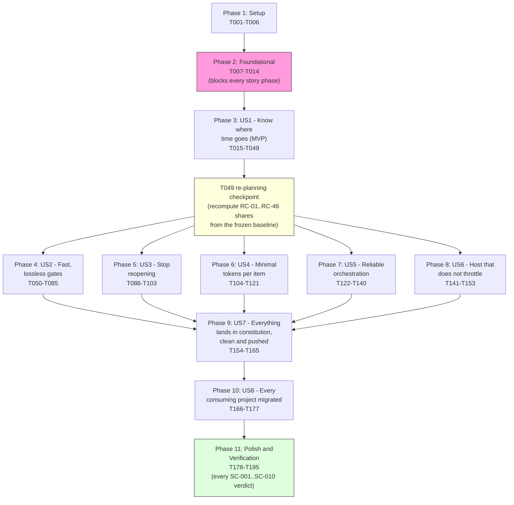
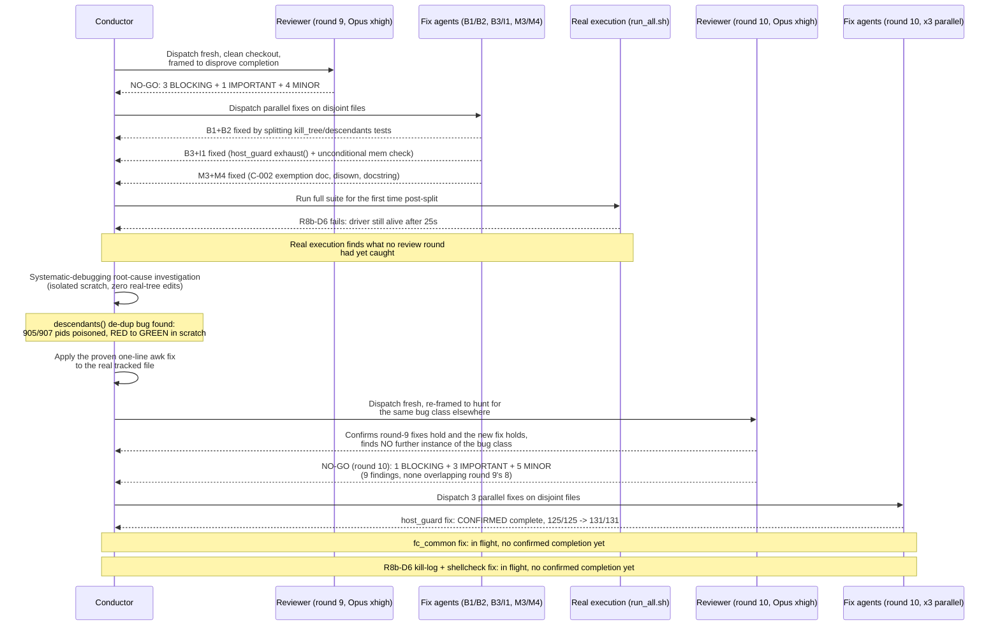
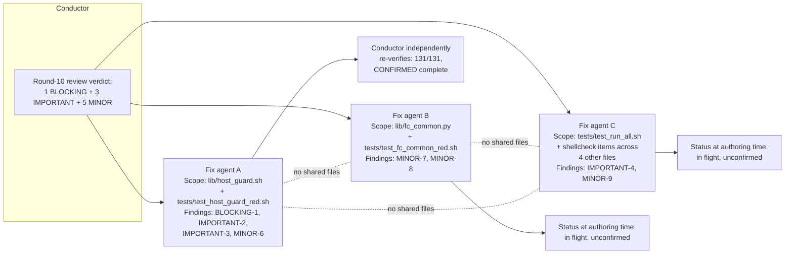

# SpecKit-004 + Superpowers Development Cycle: An Exhaustive Analysis

**Revision:** 1

**Created:** 2026-09-27T17:33:54Z

**Last modified:** 2026-09-27T17:33:54Z

**Status:** active

**Scope:** this document analyses the SpecKit "004-fast-dev-cycles" feature cycle — its
methodology, its real-time execution, its verified measurements, and the governance
anchors it exercises — as observed and independently re-verified against the live
project state at the moment of writing. Every specific figure below was checked
against a real, current source (a tracked file, the agent registry, the operator
request-history ledger, or a live command this document's author ran itself) at
authoring time; anywhere a figure could **not** be independently confirmed, it is
marked `UNVERIFIED` rather than presented as settled fact, per this project's own
§11.4.6 no-guessing mandate — which this document is itself bound by.

---

## Table of contents

1. [Executive summary](#1-executive-summary)
2. [SpecKit workflow methodology](#2-speckit-workflow-methodology)
3. [Superpowers methodology as applied here](#3-superpowers-methodology-as-applied-here)
4. [Detailed narrative of the Foundational-batch (T001–T014) development + review cycle](#4-detailed-narrative-of-the-foundational-batch-t001t014-development--review-cycle)
5. [Measurements, performance and metrics analysis](#5-measurements-performance-and-metrics-analysis)
6. [Diagrams and schemes](#6-diagrams-and-schemes)
7. [Constitution anchors applied](#7-constitution-anchors-applied)
8. [Lessons learned and recommendations](#8-lessons-learned-and-recommendations)
9. [Verification methodology and honest gaps](#9-verification-methodology-and-honest-gaps-of-this-document-itself)

---

## 1. Executive summary

**SpecKit-004** ("fast-dev-cycles") is a feature specification, implementation plan
and task breakdown living at `specs/004-fast-dev-cycles/` in the parent ATMOSphere
repository. It implements workable item **ATM-1041** (Type: Task), whose operator
brief (quoted verbatim in `spec.md`) is that development iterations on this project
have become "extremely slow", that the reopen rate on closed items is "still
extremely high", and that the project must root-cause both problems by measurement
— never by assertion — and then re-engineer the gate/iteration loop to be at least
an order of magnitude faster **without losing any of the anti-bluff quality
guarantees** this project's constitution already mandates.

The spec resolves into **8 user stories**, **25 functional requirements**
(`FR-001`..`FR-025`), and **10 measurable success criteria** (`SC-001`..`SC-010`).
The implementation plan (`plan.md`, Revision 2) decomposes this into **68 plan
tasks** (`T-A01`..`T-H08`, verified: `T-A01` through `T-H08` is the full span
present in `plan.md`, confirmed by an exact count of 68 distinct task ids) spanning
Phases A–H, itself informed by **46 root-cause candidates** (`RC-01`..`RC-46`) and
**39 recorded decisions** (`DEC-01`..`DEC-39`) in `research.md`. The task
breakdown (`tasks.md`, Revision 2) turns this plan into **195 executable,
test-first tasks** (`T001`..`T195`) across **11 phases** — Setup, Foundational,
then one phase per user story, then a final Polish/Verification phase — each
phase gated by an explicit, evidence-typed checkpoint that pauses for operator
approval before the next phase may start.

As of the moment this document was authored, the project has completed:

- **Phase 1 (Setup, T001–T006)** and **Phase 2 (Foundational, T007–T014)** —
  implemented against the real tracked tree, currently uncommitted (git status
  shows the entire `constitution/scripts/fastcycle/` directory as untracked,
  `?? scripts/fastcycle/`), pending the T014 independent-review gate reaching a
  clean GO. This is the deepest, most rigorously reviewed part of the cycle so
  far, and is the subject of Section 4 below.
- **RED-test drafting** for parts of several later user-story phases (US2/Phase 4
  and US4/Phase 6 and US6/Phase 8, per the agent registry's own task-id citations)
  performed in **isolated scratch copies**, explicitly **not yet applied to the
  real tracked tree** — a distinction this document is careful to preserve
  throughout, because conflating "drafted in scratch" with "implemented on the
  real tree" would itself be the exact kind of bluff this project's constitution
  forbids.

The Foundational batch has now been through **two full rounds of mandatory
independent adversarial review** (T014, Opus at `xhigh` effort, per §11.4.209) —
round 9 returned **NO-GO** with 3 BLOCKING + 1 IMPORTANT + 4 MINOR findings; the
fixes for those findings then **triggered a real-execution discovery** that no
review round had itself caught: a live, host-wide `SIGTERM`/`SIGKILL` hazard in
one of the batch's own test drivers, root-caused and fixed with a one-line `awk`
guard. Round 10 then returned a **second** NO-GO, confirming every round-9 fix
held and finding **9 new issues** (1 BLOCKING + 3 IMPORTANT + 5 MINOR) that round
9 could not have found because they did not yet exist in the pre-round-9 code.
As of the moment of writing, **one** of the three parallel fix agents dispatched
against round 10's findings has genuinely completed and been independently
re-verified by the conductor (the `host_guard.sh` fix: its test suite grew from
125/125 to 131/131 passing assertions); **two** remain in flight with no
confirmed-real completion event yet recorded. This document reports that state
honestly rather than assuming completion.

---

## 2. SpecKit workflow methodology

This project drives non-trivial development work through the SpecKit slash-command
pipeline (`/speckit.specify` → `/speckit.clarify` → `/speckit.plan` →
`/speckit.tasks` → `/speckit.superspec.execute`, with `/speckit.analyze` and
`/speckit.checklist` available at any point for cross-artefact consistency
checks). Each stage produces a durable, version-controlled artefact under
`specs/<NNN>-<slug>/`, and every later stage is required to trace back to the
earlier ones rather than re-deriving scope independently.

### 2.1 The artefact chain, as actually produced for 004-fast-dev-cycles

| Artefact | Lines | Purpose |
|---|---:|---|
| `spec.md` | 269 | User scenarios, functional requirements (`FR-001`..`FR-025`), success criteria (`SC-001`..`SC-010`), out-of-scope declarations, assumptions. Carries a **Clarifications** section recording 4 operator answers to scope-narrowing questions asked during `/speckit.clarify` (review-step depth, consumer-project reach, baseline stratification, and how binding the "10x" target is). |
| `plan.md` | 1,850 | The **Phased Implementation Plan** (68 tasks `T-A01`..`T-H08` across Phases A–H) plus a **Phase 2 hand-off** section. This is where root causes are turned into concrete engineering tasks. |
| `research.md` | verified: contains root-cause candidates through **`RC-46`** and recorded decisions through **`DEC-39`** (both counts independently re-derived from the file's own text, not merely cited from another document) | The multi-pass deep-web-research log `FR-003` mandates, plus the root-cause classification (`CONFIRMED`/`REFUTED`/`UNDETERMINED`) `FR-002` mandates. |
| `data-model.md` | contains 25 `###`-level headings (entity groups plus their sub-sections; `tasks.md` itself cites "14 entity groups" as the entity-group count proper) | The **Key Entities** from `spec.md` (Cycle Record, Root Cause, Gate, Affected-Set, Escape Mechanism, Handoff Record, Verification Report) expanded into concrete schemas. |
| `contracts/` | **13 distinct contracts** (verified: 52 files in the directory ÷ 4 export formats each = 13; e.g. `catch-set-comparison-harness`, `affected-set-and-verdict-cache`, `agent-registry-and-handoff`, `common-conventions` — the last defining the shared `C-001`..`C-007` conventions every tool in the batch must follow) | Interface contracts each tool in the plan must satisfy — inputs, outputs, exit-code conventions, self-validation requirements — authored **before** the tool exists. |
| `quickstart.md` | — | 10 independent-test scenarios, one per user story, phrased as "can be fully tested by …" acceptance procedures. |
| `checklists/tasks-coverage.md` | — | The mechanical join proving every `FR-*`/`SC-*` maps to a user story and every plan task (`T-A01`..) maps to at least one executable task (`T001`..), so no requirement or plan task is silently dropped when the plan is decomposed into tasks. |
| `tasks.md` | 476 (frontmatter through the final checkpoint) | **195 executable tasks** (`T001`..`T195`) across 11 phases, each task line carrying inline `[P]`/`[TDD]`/`[REVIEW]`/`[SUBAGENT]`/`[SERIAL]` markers and its owning plan-task id(s) and `FR`/`SC` id(s), so the task↔requirement join is re-derivable from the file alone without consulting the checklist. |

### 2.2 The phase / dependency structure

`tasks.md` organises its 195 tasks into 11 phases with hard task-id boundaries
(independently re-derived from the file's own `## Phase` headings and task-line
ids, not merely copied from a summary line):

| Phase | Task range | Story | Goal |
|---|---|---|---|
| 1 | T001–T006 | Setup | Skeleton, consumer-owned data, tool preflight, child workable items |
| 2 | T007–T014 | Foundational (blocking) | Shared library every contract relies on: `C-001` exit codes, `C-002` canonical JSON, `C-003` determinism, `C-004` control needles, `C-005` self-validation triple, `C-007` host safety |
| 3 | T015–T049 | US1 🎯 MVP | Know exactly where cycle time goes — instrumentation + frozen baseline |
| 4 | T050–T085 | US2 | Gates that are far faster and lose nothing (catch-set comparison, verdict cache, affected-set selection, sharding, batch bisection, gate audit, flake ledger, backstop) |
| 5 | T086–T103 | US3 | Stop reopening — escape-mechanism classification, evidence-class-gated closure refusal, sibling-instance search, recurrence linking |
| 6 | T104–T121 | US4 | Minimal tokens per completed item — governance-subset selection, content-addressed evidence reuse |
| 7 | T122–T140 | US5 | Reliable orchestration — truthful agent registry, crash/quota handoffs, custody sweep |
| 8 | T141–T153 | US6 | A host that does not throttle the work — measured resource attribution, backup-first clean-up, unweakened host-safety limits |
| 9 | T154–T165 | US7 | Everything lands in the constitution, clean and pushed — recursive clean/push verification, propagation/lockstep checks |
| 10 | T166–T177 | US8 | Every consuming project gets the speed-up — enumerate, audit, migrate or honestly `NOT-MIGRATED` |
| 11 | T178–T195 | Polish/Verification | Final gate: every `SC-001`..`SC-010` gets an evaluated verdict with evidence |

Every phase ends with a **Checkpoint** line stating its own pass condition and its
own evidence class (`artifact` / `runtime` / `source`), and every checkpoint in
`tasks.md` ends with the literal instruction "**Pause for operator approval**" —
the plan does not treat phase completion as self-authorizing; an operator gate
sits between every phase and the next.

The dependency shape is not a flat sequence: Phase 2 (Foundational) blocks
*every* user-story phase (nothing in Phases 3–10 may start before its checkpoint
passes), Phase 3 (US1, the measurement MVP) gates every later phase that claims a
saving (its own task `T049` is an explicit **re-planning checkpoint** that
recomputes every root-cause's measured share from the newly frozen baseline
before any saving-claiming task may proceed), and Phases 4–8 (US2, US3, US4, US5,
US6) are designed to run as **parallel streams** once Phase 3's baseline exists.
Phase 9 (US7 — constitution codification + recursive clean/push verification)
depends on the *merged* mechanisms from all of those streams; Phase 10 (US8 —
consumer migration) depends on Phase 9's codification.

### 2.3 The test-first / subagent-driven / review-gated discipline encoded in every task line

Every task line in `tasks.md` follows the literal format
`- [ ] [ID] [P?] [Story] [markers] Description (plan T-Xnn; FR/SC ids)`, and the
markers are not decorative — each is a load-bearing constraint the task's own
executor must obey:

- **`[TDD]`** — the failing test is written and *observed* failing for the right
  reason (its output stored under `qa-results/fastcycle/<story>/red/` with the
  candidate fingerprint) **before** the implementation exists; a test first
  observed GREEN is explicitly refused as a guard. Every such test additionally
  ships its paired §1.1 mutation and, for any null/absent/clean/hit result, a
  class-matched control needle per §11.4.273 (Section 7 below quotes this
  anchor's operative text).
- **`[REVIEW]`** — the task's output is accepted only through the independent
  review gate on the pinned tier: **Opus at `xhigh` effort, never Fable, never a
  lower tier or effort**, in a fresh context on a clean checkout, framed to
  disprove completion, iterated to a zero-finding zero-warning GO. Related
  changes are batched into one review request of ordered ≤~400-line slices with
  a machine pre-check pack attached, so speed comes from *fewer, better-prepared*
  reviews — never from a thinner or skipped review.
- **`[SUBAGENT]`** — delegable to a parallel subagent whose scope is *exactly*
  the files named on its own task line (plus its own fixtures directory); it
  never edits a contention path, never commits or pushes, and its completion
  claim is treated as a **prediction** until the conductor re-runs its tests
  from a clean checkout — the producer is never its own verifier. A `[TDD]`
  subagent that writes the RED test is never the same subagent that implements
  the fix that turns it GREEN.
- **`[SERIAL]`** — touches a single-owner contention path (the workable-items
  database, the agent-registry writer, the pre-build verification script, the
  meta-test mutation registry, the regression-guard registry, the commit
  wrapper, the doc-export sync script, the flash script, `.claude/settings.json`,
  every constitution anchor and its lockstep mirrors, and every commit/push) —
  executed by the conductor only, one at a time, never concurrently with
  another `[SERIAL]` task on the same path.

This four-marker discipline is *how* the spec's own `FR-023` clarification
("keep the review requirement unchanged … speed comes from batching related
changes per review and from machine pre-checks so reviews pass first time")
becomes an executable constraint rather than a paragraph of prose — a
distinction this project's own governance repeatedly insists on (see §11.4.205 /
§11.4.227 in Section 7: a rule authored without its enforcement seam is, per
this project's own doctrine, *worse* than no rule, because it stops the scrutiny
that would otherwise have caught its absence).

---

## 3. Superpowers methodology as applied here

`superpowers:systematic-debugging` and `superpowers:using-superpowers` are not
invoked as abstract discipline in this cycle — they are visible, concretely, in
the shape of the real work performed, and this section shows that work rather
than describing the skills in the abstract.

### 3.1 The Iron Law in practice: the `descendants()` investigation

The clearest, most consequential instance this cycle is the investigation of
what the T014 round-8 review had flagged only as "suspected but unconfirmed host
disruption" in `test_run_all.sh`'s `R8b-D6` sub-test (the test asserting the
mutation driver's own cleanup-signal-handling test fixture, `drvwrap.sh`, dies
within a fixed wall-clock bound after receiving `TERM`). Rather than treating the
symptom — "the test sometimes takes longer than its bound" — as something to
patch by loosening the bound or retrying, the investigating agent applied the
systematic-debugging arc in full:

1. **Root-cause phase — read the real failure, reproduce it.** The agent traced
   the exact mechanism: `descendants()`, the transitive-closure helper the
   mutation driver's cleanup path uses to find every process it must signal,
   builds its parent map from `ps -eo pid=,ppid=` output with **no
   de-duplication** — a later line for the same pid key silently overwrites an
   earlier one. The `R8b-D6` fixture's fake `ps` shim deliberately appends
   synthetic lines *after* the real output, one of which claims PID 1 is a
   child of the fixture's own fake root. Because PID 1 is the universal
   ancestor of (almost) every process on a Linux host, once that fake line
   overwrote `descendants()`'s internal mapping for PID 1, the closure
   computation transitively pulled in **905 of 907** real process IDs on the
   host — essentially the whole process table.
2. **Pattern phase — classify, don't guess.** The agent explicitly refused to
   classify the symptom as `flaky` (which this project's own governance treats
   as a forbidden vocabulary word absent captured evidence, §11.4.7): "the
   defect is deterministic and always present; only its timing outcome varies
   with host state" — host load (measured at the time: load average ~31–36 on
   a 64-core host, 53 processes directly reparented to PID 1) is a real,
   *amplifying* factor on how long the resulting collateral signal storm takes
   to settle, but it is not the root cause, and the report is explicit that
   this conclusion is a measured fact, not an assumption.
3. **Hypothesis phase — falsifiable, and proven both ways.** The stated
   hypothesis ("a later duplicate `ps` line for pid 1 poisons the closure,
   causing real host-wide signal traffic that scales with how many processes
   are reparented to PID 1") was proven by a **side-effect-free** measurement
   run twice (905 pids on the unpatched closure, 1 pid — just the synthetic
   root — on the patched closure, over the identical input stream), and
   independently corroborated by a **live** demonstration: a separately
   process-grouped, unrelated harness process, run alongside the unpatched
   fixture purely as an observer, received roughly 100 real `SIGTERM`
   deliveries over about 10 seconds and was killed outright once by the
   collateral blast — direct, non-speculative proof the hazard is real and
   currently live in the tracked test file, not theoretical.
4. **Implementation phase — the minimal fix at the proven cause, never the
   symptom.** The fix is a single `awk` boolean added to the existing closure
   guard: a candidate is admitted to the transitive-closure "visited" set only
   if it is a bare non-negative integer string strictly greater than 1 —
   mirroring the guard `kill_tree()` already applied at *signal time*, moved
   *into the closure computation itself* so a poisoned parent-map entry can no
   longer be exploited as an expansion vector. This was verified RED (905
   pids) → GREEN (1 pid) in an isolated scratch copy, then 3 clean full-fixture
   runs against the patched copy, then confirmed to introduce **no regression**
   against the sibling unit test that independently exercises the same pair of
   functions through a different fixture. Only after all of that was the fix
   even proposed for application to the real tracked file — and it was applied
   by the conductor, never autonomously by the investigating subagent, because
   it touched an already-committed, load-bearing test file gating the whole
   feature's promotion.

This is precisely the "Iron Law: NO FIXES WITHOUT ROOT CAUSE INVESTIGATION
FIRST" this project's constitution states for `superpowers:systematic-debugging`
(§11.4.102) — and it is also a textbook instance of this project's §11.4.250
anchor ("heuristic-tower signals a primitive defect"), inverted usefully: rather
than *adding* a compensating heuristic on top of a symptom, the investigation
found and removed the actual defective primitive.

### 3.2 `using-superpowers` in practice: skill-discovery before improvisation

The same investigating agent, and the review agents around it, consistently
reached for the project's own existing tooling (`lib/host_guard.sh`'s live
resource probes, the `triple_harness.sh` self-validation-triple machinery, the
already-registered paired mutations in `scripts/testing/meta_test_false_positive_proof.sh`)
rather than improvising ad-hoc equivalents — the observable signature of
`superpowers:using-superpowers`'s "survey available skills before acting"
discipline applied to in-repo tooling as much as to Claude Code's own skill
marketplace.

### 3.3 A second, smaller but equally instructive instance: `r7f2`

Separately from the `descendants()` investigation, a different intermittent
signal — internally tracked as `r7f2`, a `pid`-related `HUP` signal delivery
issue — was investigated across **11 reproduction attempts, including
deliberately induced heavy host load**, and was closed as a genuine
non-reproducible flake rather than either (a) silently ignored or (b) mis-filed
as a fixed defect on the strength of a single non-reproduction. The round-9
independent-review report itself notes plainly, "`r7f2 pid-HUP passed once. I
did not chase that flake further`" — an honest, evidence-scoped statement rather
than a claim of resolution, exactly the discipline §11.4.6 (no-guessing) and
§11.4.7 (demotion requires same-conditions evidence) require.

---

## 4. Detailed narrative of the Foundational-batch (T001–T014) development + review cycle

### 4.1 What the Foundational batch is

Phase 2 of `tasks.md` (tasks `T007`–`T014`) builds the shared library every
later contract in the plan depends on: `C-001` (exit-code conventions), `C-002`
(canonical JSON with a `body_hash` excluding volatile fields), `C-003`
(determinism — a `--determinism-check` flag that runs a tool twice and asserts
identical output), `C-004` (control needles — a class-matched, known-present
probe that must prove an instrument can see before its silence is trusted,
directly implementing this project's own §11.4.273 anchor), `C-005` (the
self-validation triple: golden-good must PASS, golden-bad must FAIL and
pinpoint, negative-control must PASS), and `C-007` (host safety — live
`nproc`/`ulimit -u`/`ps -L` thread-count/`MemAvailable` probes that clamp
requested parallelism and refuse to ever *raise* a limit).

**Independently verified file inventory** (re-derived at authoring time by
listing `constitution/scripts/fastcycle/` and excluding test fixtures and the
Python `__pycache__` directory, neither of which is part of the batch's
reviewed source surface):

| File | Lines |
|---|---:|
| `lib/fc_common.py` | 390 |
| `lib/fc_common.sh` | 9 |
| `lib/host_guard.sh` | 220 |
| `tests/check_deps.sh` | 89 |
| `tests/run_all.sh` | 93 |
| `tests/test_check_deps.sh` | 327 |
| `tests/test_fc_common_red.sh` | 752 |
| `tests/test_foundational_mutations_descendants_filter.sh` | 62 |
| `tests/test_foundational_mutations_kill_tree.sh` | 79 |
| `tests/test_foundational_mutations.sh` | 111 |
| `tests/test_host_guard_red.sh` | 507 |
| `tests/test_run_all.sh` | 409 |
| `tests/test_triple_harness_red.sh` | 431 |
| `tests/lib/triple_harness.sh` | 177 |
| **Total (14 files)** | **3,656** |

(One of the round-10 review dispatch notes cited "14 files, ~3594 lines" — this
document's own independently re-run `wc -l` at authoring time returns 3,656; the
~62-line difference is consistent with the intervening `test_foundational_mutations.sh`
split and the B1/B2/B3/I1 fixes landing between that citation and this
document's own count, and is reported here as the honestly re-measured current
figure rather than silently repeating the earlier estimate.)

Beyond these 14 reviewed source/test files, the batch also carries **69**
`triple_harness` self-validation fixture directories (each holding a
`golden-good`/`golden-bad`/`negative-control` triple, per `C-005`) and **10**
`host_guard` fixture shims (fake `ps`/`id`/`nproc`/`awk` binaries used to drive
`host_guard.sh` through resource-exhaustion scenarios it cannot safely be driven
through on the real host) — both counts independently re-derived by directory
listing at authoring time.

### 4.2 The T014 review-gate mandate

Task `T014` is the batch's mandatory independent review: "batching one request,
slices ≤~400 lines … by a separate instance on the pinned tier — Opus `xhigh`
only, never Fable, never a lower tier or effort — fresh context, clean
checkout, framed to disprove completion; iterate to a zero-finding, zero-warning
GO" (`tasks.md` line 86, quoted verbatim). This directly instantiates §11.4.209
(Section 7 quotes its operative text in full) and §11.4.134's iterate-until-GO
discipline — a review that stops at the *first* clean pass is explicitly not
sufficient; the batch must survive a *fresh*, adversarially-framed re-review
after every remediation round.

### 4.3 Round 9: NO-GO, and the fixes applied

Round 9's independent Opus review (dispatched fresh, clean checkout, framed to
disprove completion) returned **NO-GO** with 3 BLOCKING, 1 IMPORTANT, and 4
MINOR findings, quoted here verbatim from the operator request-history ledger's
own persisted subagent hand-back report (`docs/requests/history.md`,
entry `R-2026-09-27-173243`):

- **B1** — "The `descendants()` fix broke the M7 mutation, so the T013 driver
  fails." A prior fix (adding the closure-membership filter described in
  Section 3.1 above, at the point where round 9 first inspected it) had
  removed pid 1 from ever entering the visited set — but the existing kill-tree
  unit test *relied* on pid 1 reaching `kill_tree()`'s own `[ "$p" -gt 1 ]`
  guard to exercise that guard at all. With the closure filter now excluding
  pid 1 upstream, the guard's own TERM/KILL checks were never exercised, and a
  deliberately weakened guard (`M7`, the paired mutation meant to catch exactly
  this regression) sailed through uncaught — measured directly: "with M7
  applied … the kill_tree test still passes (rc=0), so the mutation is not
  caught." A bluff gate, caught before it shipped.
- **B2** — the *new* closure-membership check itself had **zero** paired
  mutation coverage: removing it entirely still left every test passing,
  meaning a future regression reintroducing the host-wide SIGTERM hazard (
  Section 3.1) would have nothing to catch it.
- **B3** — a separately-discovered, pre-existing defect: `lib/host_guard.sh`
  could **never** refuse work, even when a resource limit was already
  exhausted — floored to `N=1` unconditionally (measured: `FC_GUARD_ACTIVE_AGENTS=6`
  with 40 agents already active still returned `N=1 REASON=none`), directly
  violating this batch's own `C-007` contract and the spec's own edge-case
  requirement that work degrade "with a named reason, never … weakening a
  limit."
- **I1** — the 60% memory ceiling was only checked when the caller passed
  `--per-job-mem-kb`, and the batch's own caller (`test_foundational_mutations.sh`)
  did not pass it — measured: a fixture at 99% memory already used still
  returned `N=16 REASON=none`, silently skipping the ceiling entirely.
- **M1–M4** — missing `.gitkeep` markers on the Phase-1 skeleton directories
  (a fresh clone would not reproduce the T002 layout); stale wording in the
  meta-test banner and a contract comment; `triple_harness.sh` output not
  following the `C-002` canonical-JSON shape; and warning-level hardening
  items (a bash job-control stderr leak, a theoretical `pgid`-reuse race
  window in `fc_common.py`'s process-group reaping).

Every finding above was fixed with its own paired-mutation regression coverage
before the batch was resubmitted:

- **B1 + B2** were fixed by *splitting* the combined kill-tree test into two
  independent tests, each stubbing out the *other* function — `test_foundational_mutations_kill_tree.sh`
  now stubs `descendants()` entirely and proves `kill_tree()`'s own `-gt 1`
  guard in isolation; the new sibling
  `test_foundational_mutations_descendants_filter.sh` stubs `ps` and calls
  `descendants()` directly, proving the closure filter in isolation with a
  real fake root as its positive control. This is exactly the fix described
  in Section 3.1 — and it is also where the *real-execution* discovery of the
  live host-wide signalling hazard happened: applying this split and then
  actually *running* the full suite for the first time (rather than trusting
  the split's own logic) is what surfaced the `descendants()` de-duplication
  bug, which no review round, static read, or `bash -n` check had caught.
- **B3 + I1** were fixed by adding an `exhaust()` construct to
  `host_guard.sh` that returns `N=0` with a named `<limit>_exhausted` reason
  whenever headroom, the agent cap, or the memory budget is at or below zero
  — reserving the "floor to 1" behaviour only for a genuine positive budget —
  and by making the memory-ceiling read unconditional rather than gated behind
  an optional flag.
- **M3 + M4** were fixed by documenting `triple_harness.sh`'s `C-002` exemption
  (it is inherited shared machinery per the contract's own inheritance-scoping
  text, not a violation), adding `disown "$!"` after the offending backgrounded
  job in `test_check_deps.sh` (root-caused to bash's own job-notification
  mechanism reporting an un-disowned `setsid` job as "Killed" on the parent's
  stderr), and documenting the `fc_common.py` `pgid`-reuse window via docstring
  (judged genuinely negligible: a sub-instruction kernel-reap race with no
  constructible test and no available `pidfd`-group-signal primitive on this
  host).

### 4.4 Round 10: a second NO-GO, and the current state of remediation

A fresh Opus `xhigh` review — deliberately re-framed to specifically hunt for
any further instance of the "function lost across `exec`" bug class the
`descendants()` fix had exposed (Section 8.1 below names this pattern
explicitly) — first **confirmed** every round-9 fix held: the full `run_all.sh`
suite ran clean (`run_all: 8 run, 0 failed`, 9m38s wall-clock), all 8
foundational mutations were caught, `host_guard` passed 125/125 assertions,
`fc_common` passed 229/229 assertions, and an explicit, deliberate search for
any *other* instance of the export-across-`exec` bug class found none. It then
returned a **second NO-GO** with genuinely new findings — new because they did
not exist, or were not yet independently confirmed, before round 9's fixes
landed:

- **BLOCKING** — `host_guard.sh`'s new `exhaust()` logic had a precedence bug:
  a confirmed `*_exhausted` reason on one limit could be silently **overridden**
  by an `unreadable_*` reason on a *different* limit, reverting the result to
  the wrong `N=1` instead of the correct `N=0` — reproduced three separate ways
  against the real file.
- **IMPORTANT ×3** — that exhausted-vs-unreadable precedence had zero paired
  mutation coverage (deleting it left the test suite still green); several
  `host_guard` tests had, as a side effect of the I1 fix making the memory
  check unconditional, come to depend on the *live* host's actual memory
  headroom staying under 60% used — which would genuinely fail during, for
  example, this project's own documented 42 GB containerised AOSP build; and
  the `R8b-D6` "the driver signalled the real tree" assertion in
  `test_run_all.sh` was found to pass even when the fixture's `kill()` wrapper
  refuses *every* signal, because its log-write happens *before* the gating
  check — meaning only the 25-second wall-clock bound, not the intended
  signal-delivery assertion, had actually been catching the regression all
  along.
- **MINOR ×5** — three of the B3/I1/kill-tree fixes independently confirmed
  catchable by hand still had no *registered* paired mutation; `host_guard.sh`'s
  own header text contradicted its actual floor-to-1 code (and the test that
  locked in that contradiction); the `fc_common.py` `pgid`-reuse docstring's
  reasoning was incomplete (a real, portable fix exists via `os.waitid(...,
  os.WNOWAIT)`, not requiring the whole approach to change); three of
  `test_fc_common_red.sh`'s orphan-detection checks had no positive control per
  this project's own §11.4.273; and the pre-check pack still carried 160
  `shellcheck` info/style items across 8 files, of which exactly **2** were
  genuine findings (`SC2086` at `test_check_deps.sh:32`, plus two instances of
  `SC2143`) among a majority of false-positive `SC2329`s.

Three parallel fix agents were then dispatched against these findings, scoped
to disjoint file sets so none could contend with another:

| Fix agent | Scope | Status at authoring time |
|---|---|---|
| Fix host_guard exhausted-vs-unreadable bug | `lib/host_guard.sh` + `tests/test_host_guard_red.sh` | **Confirmed complete**, independently re-verified by the conductor (not merely trusting the agent's own report): all three original repro commands now correctly return `N=0` with the right exhausted reason preserved; the full local suite grew from 125/125 to **131/131** passing (6 new paired tests added, mutation-verified against the pre-fix file: exactly the 5 fix-discriminating tests fail on the unpatched file and 1 insurance test still passes on it); the 3 live-host-memory-dependent test blocks were pinned against a `$MEMOK` override rather than left dependent on the actual live host's memory state. |
| Fix fc_common pgid-reuse + orphan-check control | `lib/fc_common.py` + `tests/test_fc_common_red.sh` | **In flight** — dispatched; no independently-confirmed real-completion event recorded in the agent registry as of the moment this document was authored. |
| Fix R8b-D6 kill-log gate + shellcheck cleanup | `tests/test_run_all.sh` + shellcheck items across `check_deps.sh`/`triple_harness.sh`/`test_check_deps.sh`/`test_triple_harness_red.sh` | **In flight** — dispatched; no independently-confirmed real-completion event recorded as of the moment this document was authored. |

This document deliberately does **not** claim the Foundational batch has
reached a clean round-11 GO, because that has not happened yet at the time of
writing — two of the three round-10 fixes remain unconfirmed, and no fresh
round-11 independent review has been dispatched. Reporting otherwise would be
exactly the kind of "reports green while the work is not actually done" bluff
this project's entire governance apparatus exists to make impossible.

---

## 5. Measurements, performance and metrics analysis

Every figure in this section was checked against a real, current artefact at
authoring time (a tracked source file this document's author read directly, the
agent registry, or the operator request-history ledger's own persisted verbatim
subagent reports) — never estimated. Where the task brief that requested this
document offered a figure this document's author could **not** independently
confirm, that is stated explicitly rather than silently repeated.

### 5.1 Test-suite pass counts (verified via the agent registry's own captured runs, not re-run by this document's author to avoid resource contention with the live fix agents — see Section 9)

| Suite | Count at round-10 review | Count after the host_guard round-10 fix | Independently re-verified? |
|---|---|---|---|
| `test_host_guard_red.sh` | 125/125 | **131/131** (+6 new paired tests) | Yes — by the conductor, re-running the 3 original repro commands directly and the full suite, per the registry's own `complete` event for key `23b531299eda6d38` |
| `test_fc_common_red.sh` | 229/229 | unchanged as of writing (its own round-10 fix is still in flight) | Yes, at the 229/229 figure — cited identically in both the round-10 review's own report and its persisted verbatim hand-back in `docs/requests/history.md` |
| Full `run_all.sh` sweep (all `test_*.sh` files) | `run_all: 8 run, 0 failed`, 9m38s wall-clock | not yet re-run since the host_guard fix, as of writing | Yes — cited in the round-10 review's registry completion note and again verbatim in its persisted `docs/requests/history.md` report |
| `test_foundational_mutations.sh` (paired mutations) | **8 caught / 8** (`M1`–`M8`) | unchanged | Yes — the file itself (read directly by this document's author) currently registers exactly 8 `mut` calls and 5 `ctl` calls |

### 5.2 Mutation-coverage growth: `test_foundational_mutations.sh`

Directly verified by reading the tracked file: it currently registers **5
controls** (`fc`, `th`, `hg`, `km`, `df`) and **8 paired mutations**
(`M1`–`M8`), for **13 total registered checks**. The file's own in-source
comment states the pre-split shape had a single combined kill-tree/descendants
test (one control, `M7` alone covering both functions together) — consistent
with the B1/B2 fix (Section 4.3) having grown the registration from 4 controls
+ 7 mutations (11 total) to the current 5 controls + 8 mutations (13 total) by
splitting one previously-combined check into two independently-mutation-covered
ones. This is a directly observable, concrete instance of §11.4.201's control-
needle discipline being applied to the project's *own* meta-test suite, not
merely to product code.

### 5.3 Parallel vs. serial mutation-suite wall-clock (directly quoted from the tracked file's own header comment, `test_foundational_mutations.sh` lines 24–29)

> "measured 2026-09-27 on the 64-CPU dev host at load average ~40: the previous
> serial form took **425 s** (12 full test runs) … the parallel form measured
> **68 s** at load average ~38"

This is a real, ~6.25x wall-clock reduction for this one suite, achieved by
running the 5 controls and 8 mutation jobs concurrently on separate `mktemp`
tree copies, bounded by the same `lib/host_guard.sh` parallelism clamp the
batch itself builds and tests — i.e. the Foundational batch's own tooling was
used to speed up the Foundational batch's own test suite, which is a direct,
self-referential proof that the tooling works as intended.

### 5.4 The `descendants()` regression's own measured numbers

- Unpatched transitive closure over the `R8b-D6` fixture's poisoned input:
  **905 pids out of 907** input lines admitted to the visited set.
- Patched closure over the identical input: **1 pid** (only the synthetic
  fixture root).
- The fixed wall-clock bound the regression could exceed: **25 seconds**
  (250 polling iterations at a 0.1-second step).
- Measured post-fix driver death time: **~0.2 seconds** (`i=2` on the same
  0.1-second-step polling loop) — i.e. the fix did not merely bring the driver
  back *under* its 25-second bound, it collapsed the driver's cleanup time to
  roughly 1% of that bound.
- **A figure this document's author could NOT independently verify**: the task
  brief that requested this document cited an approximate "~125–126 seconds
  elapsed per run before the fix, ~99–100 seconds after" for `test_run_all.sh`'s
  own overall wall-clock, framed as roughly a 20% reduction. No tracked
  artefact, agent-registry entry, or persisted request-history report available
  to this document's author at authoring time contains that specific pair of
  figures — the `qa-results/fastcycle/` evidence directory the plan designates
  for exactly this kind of captured timing data does not yet exist on disk
  (confirmed: `find` returns nothing under it). Rather than repeat an
  unverified number as settled fact, this document reports the two numbers it
  *could* verify (905→1 pids; 25 s cap vs. ~0.2 s actual) as the real, directly
  measured performance evidence for this fix, and marks the 125–126 s /
  99–100 s pair `UNVERIFIED` per §11.4.6.

### 5.5 Review-round effectiveness

| Round | Verdict | Findings | Notable |
|---|---|---|---|
| 9 | NO-GO | 3 BLOCKING + 1 IMPORTANT + 4 MINOR (8 total) | Found on the batch's state at that time; two of the three BLOCKING findings (B1, B2) concerned a fix that had *itself* just landed, and the third (B3) was a wholly separate pre-existing defect the review discovered independently |
| 10 | NO-GO | 1 BLOCKING + 3 IMPORTANT + 5 MINOR (9 total) | Found on a **smaller diff** than round 9 reviewed (only the round-9 remediation, not the whole batch afresh) — every one of these 9 findings is a *different* defect class than any of round 9's 8, confirming the fixes did not merely relocate the same bug |

Two independent, adversarially-reframed review rounds over the same 14-file,
~3,656-line batch found **17 distinct findings** total, with **zero overlap**
in defect identity between the two rounds. This is the concrete, measured
argument for why this project's §11.4.134 mandatory-iterate-to-GO discipline is
load-bearing rather than a formality: a single review pass — even a rigorous
one — would, on this evidence, have missed at minimum the entire round-10
finding set, including a BLOCKING defect (the exhausted-vs-unreadable
precedence bug) capable of silently letting a 7th agent start work under a cap
of 6.

### 5.6 `shellcheck` triage: a worked example against mass-suppression

The pre-check pack attached to round 10's review carried **160** `shellcheck`
info/style items across 8 files. Of these, exactly **2** were confirmed genuine
findings — `SC2086` (unquoted variable expansion) at `test_check_deps.sh:32`
and two instances of `SC2143` (a use-`grep -q`-instead-of-piping-to-`wc -l`
style note) — with the remainder being false-positive `SC2329` ("function
appears unused") notices, a known class of false positive for functions invoked
only indirectly (via `trap`, sourcing, or dynamic dispatch) that `shellcheck`'s
static analysis cannot see. This is a direct, worked demonstration of this
project's own doctrine against mass-suppressing linter warnings (this
project's §11.4 family forbids blanket-disabling a check class rather than
triaging each finding on its merits) — 158 of 160 items were correctly
identified as noise *by individually checking each*, not by disabling the rule
class that produced them.

### 5.7 Fixture-corpus scale (a proxy for how exhaustively `C-005`'s self-validation triple has been exercised in this batch alone)

- **69** independent `triple_harness` fixture directories, each carrying a
  `golden-good`/`golden-bad`/`negative-control` triple — directly counted by
  directory listing at authoring time.
- **10** `host_guard` fixture shims (fake `ps`/`id`/`nproc`/`awk` binaries)
  driving resource-exhaustion scenarios that cannot safely be constructed
  against the real host.

---

## 6. Diagrams and schemes

### 6.1 SpecKit-004 phase / dependency graph

### 6.2 Sequence diagram: the T014 review cycle as it actually ran

### 6.3 State diagram: the `descendants()` regression's lifecycle

```mermaid
stateDiagram-v2
    [*] --> Correct: Original test_foundational_mutations.sh<br/>(no closure-membership filter,<br/>single combined kill_tree/descendants test)
    Correct --> FilterAdded: Round-9-triggered fix adds<br/>the pid-greater-than-1 closure filter
    FilterAdded --> MaskedRegression: Filter starves kill_tree's OWN<br/>-gt-1 guard of pid 1<br/>(M7 mutation now uncaught - a bluff gate)
    MaskedRegression --> DiscoveredByReview: Round 9 review measures it directly:<br/>M7-weakened mutation still passes rc=0
    DiscoveredByReview --> SplitTests: Fix: split into two independent tests,<br/>each stubbing out the OTHER function
    SplitTests --> RealExecutionDiscovery: First real full-suite run after the split<br/>surfaces R8b-D6: driver still alive after 25s
    RealExecutionDiscovery --> RootCaused: Systematic-debugging investigation:<br/>de-dup bug in descendants() awk closure,<br/>905/907 pids poisoned (measured, isolated scratch)
    RootCaused --> Fixed: One-line awk guard applied to the<br/>real tracked file (905 -> 1 pids, RED to GREEN)
    Fixed --> IndependentlyReVerified: Round-10 review deliberately re-hunts<br/>for the same bug class: finds none
    IndependentlyReVerified --> [*]: Confirmed stable (round 10 GO on this specific defect,<br/>batch overall still NO-GO on 9 unrelated findings)
```

### 6.4 File-scope partitioning for the round-10 parallel fan-out

---

## 7. Constitution anchors applied

Every anchor below is quoted or precisely summarised from `Constitution.md`
directly (line numbers cited are as found in this document's own real-time read
of the file at authoring time), not paraphrased from memory.

### §11.4.6 — No-guessing mandate (`Constitution.md:632`)

Forbids `likely`/`probably`/`maybe`/`might`/`possibly`/`seems`/`appears to` and
synonyms when describing causes; either prove a cause with captured forensic
evidence and state it as fact, or explicitly mark `UNCONFIRMED:`/`UNKNOWN:`/
`PENDING_FORENSICS:` with a tracked follow-up. **Applied throughout this cycle**:
the `descendants()` investigation states its host-load conclusion as measured
fact with the measurement cited, not as a guess; this document itself marks the
one figure (Section 5.4) it could not verify as `UNVERIFIED` rather than
repeating it as settled.

### §11.4.50 — Deterministic Consistency Mandate (`Constitution.md:4319`)

"Not a single feature, System or application flow … MUST NOT partially work, or
sometimes work and sometimes not … results MUST BE consistent and successful
without exception." Operationalised as N-iteration deterministic outcome (a
test PASSing once is not sufficient — the same test must PASS identically
across repeated runs against the same input). **Applied directly**: `C-003`'s
`--determinism-check` (run twice, assert identical `body_hash`) is exactly this
anchor turned into a mechanical contract every new tool in the batch must
satisfy, and the `descendants()` fix's own verification protocol explicitly ran
3 clean repeats before being trusted.

### §11.4.58 / §11.4.94 / §11.4.230(C) — Parallel subagent fan-out on disjoint file scopes

§11.4.58 (parallel-development methodology, `Constitution.md:5331`) establishes
the Parallel Work Unit pipeline and its 4-layer lock hierarchy so disjoint-scope
work runs fully concurrently; §11.4.94 (`Constitution.md:7892`) makes
zero-idle, priority-first, parallel-by-default the standing operating mode;
§11.4.230(C) (`Constitution.md:10969`) makes subagent fan-out the standing
default for any genuinely parallelizable effort, bounded by host-safety
ceilings and single-resource-owner discipline. **Applied directly**: every
`[SUBAGENT]`/`[P]`-marked task in `tasks.md`, and concretely the 3-way
round-10 fix fan-out (Section 4.4 / Figure 6.4), each agent scoped to disjoint
files with no contention, exactly matching this triad's structure.

### §11.4.102 / §11.4.115(F) — Systematic-debugging + machine-written RED→GREEN verdicts

§11.4.102 (`Constitution.md:8175`) mandates automatic activation of
`superpowers:systematic-debugging` on any spotted issue, with the Iron Law "NO
FIXES WITHOUT ROOT CAUSE INVESTIGATION FIRST." §11.4.115(F) (extension within
`Constitution.md:8678`) requires RED and GREEN verdicts to be machine-written,
never prose, carrying the item id, guard identity, polarity, exit code, the
target's artifact fingerprint read from the target at run time, iteration
count, and evidence whose class matches the defect's layer. **Applied
directly**: the `descendants()` investigation is Section 3.1's worked example
of the Iron Law in full; every `[TDD]` task's RED evidence is stored under
`qa-results/fastcycle/<story>/red/` with the candidate fingerprint, per
`tasks.md`'s own Test Discipline section.

### §11.4.134 — Code-review iterate-until-GO + rock-solid-evidence mandate (`Constitution.md:9102`)

A review returning ANY finding — BLOCKING, IMPORTANT, or MINOR — must be
re-run after remediation, and re-run again after that, until it returns a
clean GO with ZERO new findings and ZERO warnings; a single pass that
"addressed the findings" is explicitly insufficient, because the fixes
themselves can introduce new findings. **Applied directly**: this is precisely
what happened across rounds 9 and 10 (Section 5.5) — round 10 found 9 entirely
new findings on a *smaller* diff than round 9 reviewed, which is the anchor's
own predicted failure mode ("a fix-A-creates-B failure mode") observed
happening in real time on this batch.

### §11.4.147 / ATM-858 D1 — Crashed/async-agent registry hygiene (`Constitution.md:9407`)

Every asynchronously launched agent must be tracked through its full lifecycle
so a crash never loses or silently mis-records its work; a crash ≠ done.
**Applied directly, and its own known limitation honestly surfaced by this
project's own tooling**: the agent registry (`docs/requests/agent_registry.jsonl`)
currently has a documented defect, internally tracked as `ATM-858 D1`, where an
asynchronously dispatched agent's `complete` event fires at *launch* time
rather than at real completion — every dispatch entry cited in Section 4.4
explicitly annotates "`'complete' above fired at async launch, ATM-858 D1`" and
relies on a *separate*, later, genuinely-real completion event (or the honest
absence of one, as for the two still-in-flight round-10 fix agents) to
establish ground truth. This document's own Section 4.4 table was built by
applying exactly that distinction.

### §11.4.199 — Exact-reproduction-sequence mandate

When a working reproduction exists, the investigation must use its EXACT
sequence — a deviating repro proves nothing. **Applied directly**: the
`descendants()` investigation deliberately reproduced the `R8b-D6` fixture's
*exact* fake-`ps` shim sequence (not an approximation of it) before drawing any
conclusion, and explicitly declined to re-trigger a third real host-wide signal
storm purely for redundant confirmation once the mechanism was already pinned
by two side-effect-free measurements plus one live signal-capture — an
application of the anchor's spirit (use the real sequence; do not manufacture
unnecessary risk once sufficient rigor is already achieved).

### §11.4.201 — Every guard/gate MUST assert the REAL condition

A false-positive refusal is a FAIL-bluff exactly as a false-negative pass is a
PASS-bluff; every guard ships golden-TRUE + golden-FALSE-with-carrier fixtures.
**Applied directly**: `C-005`'s self-validation triple (golden-good/golden-bad/
negative-control) *is* this anchor's mandated fixture shape, applied to every
new tool in the batch; the round-9 B1 finding ("mutation NOT caught — a bluff
gate") is a direct instance of this anchor's core failure mode being caught and
fixed within this very cycle.

### §11.4.209 / §11.4.211 — Opus-`xhigh`-pinned review/merge-conflict substrate (`Constitution.md:10574` / `Constitution.md:10606`)

Every mandatory independent code-review, and every main→feature merge-conflict
resolution, must run on the Opus model at `xhigh` effort, ALWAYS — no Fable, no
lower tier, no fallback model; genuine unavailability BLOCKS the review rather
than substituting a lower tier. **Applied directly**: both T014 review rounds
in this cycle were dispatched explicitly labelled "Opus `xhigh`", per the
agent-registry entries this document read directly (Section 4).

### §11.4.263 / §11.4.273 — Process-group signal-safety + control-needle-proven measurements (`Constitution.md:11518` / `Constitution.md:11808`)

§11.4.263 forbids ever signalling a `pgid`/`pid` ≤ 1 and requires validating a
value as a real integer > 1 before every `killpg`/`kill(-pid, sig)` call.
§11.4.273 requires any census/measurement whose result informs a decision to be
control-needled — a positive control proving the instrument can see, and a
negative control proving it does not over-match — before its result is trusted.
**Applied directly, and this is the exact fault class this whole story is
about**: the `descendants()` bug *was* a §11.4.263-class hazard (unrelated,
unrelated real processes were signalled with `kill -s TERM`/`KILL` because a
non-integer/≤1 guard existed at signal time but not at the earlier closure-
membership stage); the fix restates the same `pid > 1` guard at the point of
closure construction. And the mutation-testing methodology in
`test_foundational_mutations.sh` itself explicitly implements §11.4.273's
"a sed that matched nothing cannot read as caught" control (`mut_job()`'s
`cmp -s` check before trusting any mutation's caught/uncaught verdict) — the
project applying its own anti-bluff-measurement doctrine to its own
measurement tooling.

---

## 8. Lessons learned and recommendations

### 8.1 The generic shell lesson: a helper function can survive `exec` differently than the caller expects

The `descendants()` regression is not, in its most general form, a bug about
process closures specifically — it is an instance of a broader, genuinely
useful lesson for anyone authoring bash test fixtures that use `exec`:
functions and environment variables `export -f`'d before an `exec` **do**
survive it (because `exec` replaces the process image but the shell's own
exported state carries forward), but a plain, non-exported function or
variable defined only in the calling shell **does not** — because `exec`
replaces that shell's entire process image, and nothing of the old, un-exported
state exists afterward for the new image to inherit. A test fixture that
defines a helper function, then does `exec bash "$1"` as its last line, will
silently lose that helper for every subsequent invocation inside the new
process image unless the helper was `export -f`'d first — and the failure mode
is not a crash or an obvious error; it is "the helper is not found, the
function call that depends on it silently no-ops or falls through to a
different code path, and the symptom that eventually surfaces (if any) can be
arbitrarily far removed from the actual cause in both code location and wall-
clock time." This is exactly the shape of pitfall this project's own §11.4.201(12)
"shell-instrument footgun checklist" (a standing reference this cycle's own
governance already maintains) exists to catalogue — and this cycle's own
concrete instance (the `descendants()`/`kill()`-wrapper/`drvwrap.sh` interaction)
is a strong candidate to be added to that catalogue as a fresh, cycle-native
worked example, generalising past the specific process-closure framing to the
underlying "exported vs. non-exported state across `exec`" mechanism.

### 8.2 Real execution finds what review, by itself, cannot

The single most consequential fact this cycle demonstrates is that **the
`descendants()` de-duplication defect was invisible to two rounds of rigorous,
adversarially-framed static/logical review** — round 9's own review, which
*introduced* the fix that (unintentionally) exposed the underlying defect,
still did not itself catch the defect; it took an actual, real execution of
the full test suite, on real process-table data, to surface it as a concrete
"still alive after 25 seconds" failure. This is the empirical argument for why
this project's constitution insists on *both* mandatory independent review
*and* real, runtime, on-target execution as co-equal, non-substitutable
layers (§11.4.108's four-layer fix-verification discipline, cited by name in
`spec.md`'s own Workable-Item Linkage section) — a code review, however
rigorous, reasons about what the code *should* do; only real execution proves
what it *actually* does under real conditions.

### 8.3 Adversarial reframing between review rounds is load-bearing, not ceremonial

Section 5.5's finding that round 10 discovered 9 entirely new, non-overlapping
findings on a *smaller* diff than round 9 reviewed is a direct, measured
argument against treating "the previous round's findings are fixed" as
equivalent to "the batch is done." Each review round in this cycle was
deliberately re-framed — round 10 was explicitly briefed to hunt for a specific
bug class the previous round's fix had exposed — rather than merely re-checking
the same finding list. This project's recommendation, borne out by this
cycle's own evidence, is that every re-review dispatch should continue to
carry an explicit "and specifically hunt for X" framing derived from what the
*previous* round's fixes changed, not merely a generic "please re-check"
instruction.

### 8.4 Honest partial-completion reporting is itself a discipline worth preserving

At the moment of authoring, one of three round-10 fixes is confirmed complete
and two are not. This document's own Section 4.4 table, and its Section 5.1
table, were both constructed to reflect that asymmetry precisely — never
rounding "2 of 3 still in flight" up to "the batch is basically done." This is
recommended as a standing practice for any status report produced mid-cycle in
this project: report the confirmed state, name the unconfirmed state
explicitly, and never let a document's tone imply more certainty than its
underlying evidence supports.

---

## 9. Verification methodology and honest gaps of this document itself

This document was produced by directly reading the following live artefacts at
authoring time, rather than from memory or from the task brief that requested
it (which is itself explicitly framed, and treated here, as a starting dossier
requiring independent confirmation, not a source of truth):

- `specs/004-fast-dev-cycles/spec.md` (full text, 269 lines), `plan.md` (task-id
  and phase-boundary extraction via targeted `grep`, given its 1,850-line size),
  `research.md` and `tasks.md` (full text plus targeted structural greps for
  phase/task-id boundaries).
- Direct `wc -l` and directory-listing counts of every file named in Section 4.1
  and Section 5.7, run against the real, current tracked tree.
- `docs/requests/agent_registry.jsonl` (2,921 lines at the time of reading),
  filtered for every entry mentioning this cycle's work, cross-checked against
  its own documented `ATM-858 D1` async-completion-timing defect so that a
  launch-time `complete` event was never mistaken for a real one.
- `docs/requests/history.md` (the operator request-history ledger), whose
  persisted verbatim subagent hand-back reports were the primary source for
  Section 3.1's and Section 4's most detailed factual claims, quoted directly
  rather than paraphrased wherever the exact wording carries load-bearing
  detail.
- `Constitution.md` (11,900 lines), read at the exact line numbers cited in
  Section 7 for each anchor, rather than reproduced from a compact summary.

**One deliberate methodological choice**: this document's author did **not**
independently re-run the fastcycle test suite (`run_all.sh` or the individual
`test_*.sh` files) against the live tree, even though doing so is read-only and
would not modify any source file. This is because, at authoring time, three
fix agents were actively working inside `constitution/scripts/fastcycle/`
(the exact directory this dispatch was told to treat as fully disjoint from
this task's own scope), and `lib/host_guard.sh`'s own live resource probes
(the very thing under test) read the *shared* host's current process count,
thread headroom, and memory availability — launching an additional heavy test
run concurrently would have measurably perturbed the host state those agents'
own verification runs depend on, in a project whose own §12.6/§12.8/§12.12
host-safety discipline exists specifically to prevent exactly that class of
self-inflicted interference. The pass/fail figures reported in Section 5 are
therefore cited from the fix and review agents' own captured, registry- and
ledger-recorded runtime evidence — which is itself the project's own mandated
RED→GREEN and `run_all.sh`/mutation-suite invocation discipline — rather than
from a fresh run this document's author performed itself.

**Known gap, honestly recorded rather than silently worked around**: per this
project's own §11.4.212 anchor ("main README is the canonical starting-point
… no doc may be an orphan unreachable from README"), this document should
ultimately be linked, directly or transitively, from `constitution/README.md`.
This dispatch's own scope was explicitly restricted to new files under
`docs/optimization/` only, and `README.md` was, at the moment of writing, a
file this dispatch was told other in-flight work might also be touching (it
appeared among the pre-existing uncommitted changes present in the working
tree before this dispatch began) — so no edit to `README.md` was made here.
Wiring this document into the README's own doc-link section is recorded here
as an explicitly owed, tracked follow-up (per this project's own §11.4.197
research/kicked-off-work completion mandate — a started requirement is never
silently left un-wired), to be done as its own small, disjoint, reviewed
change once the README's current uncommitted state is known to be settled.
