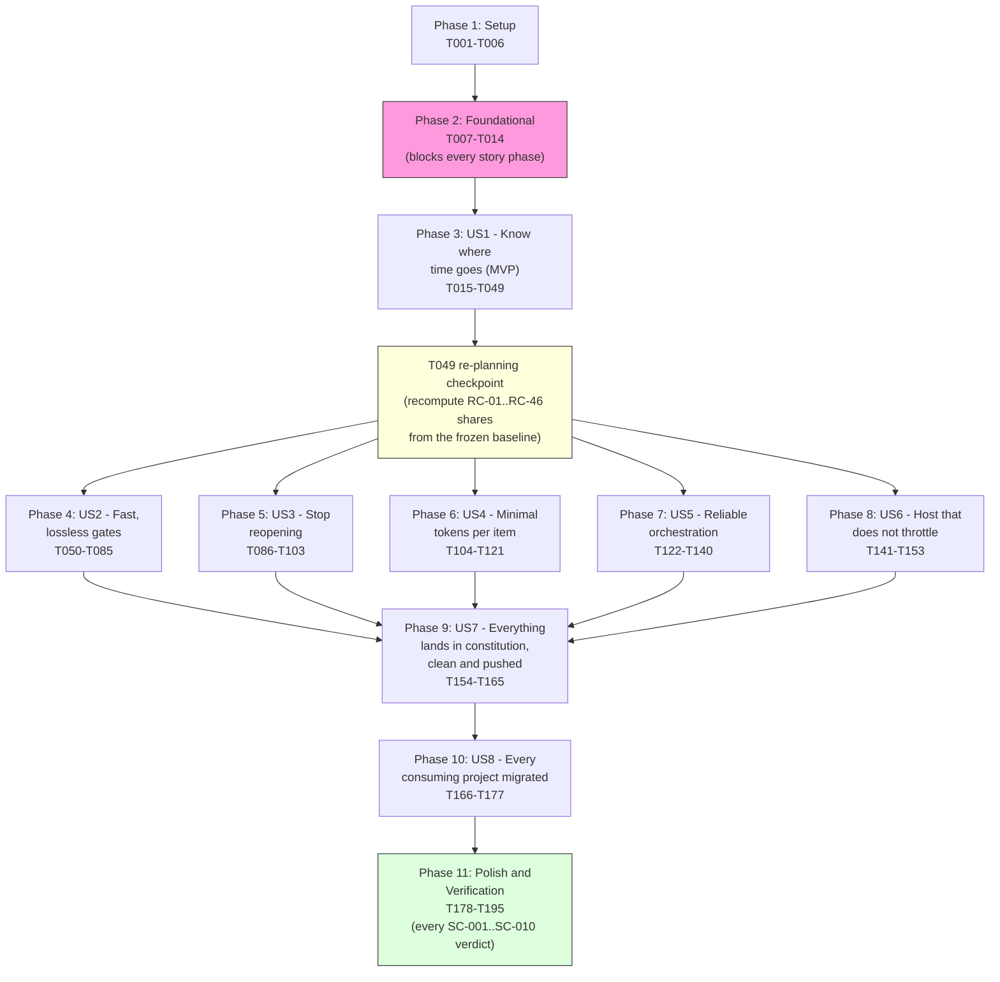
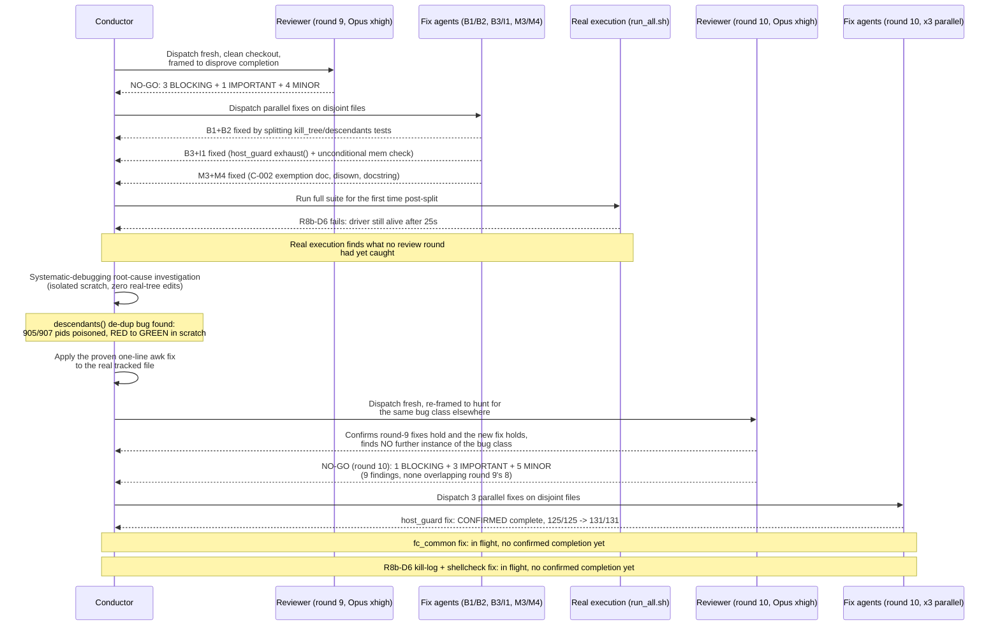
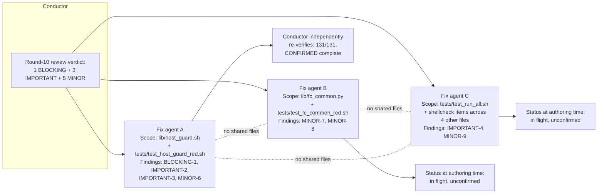
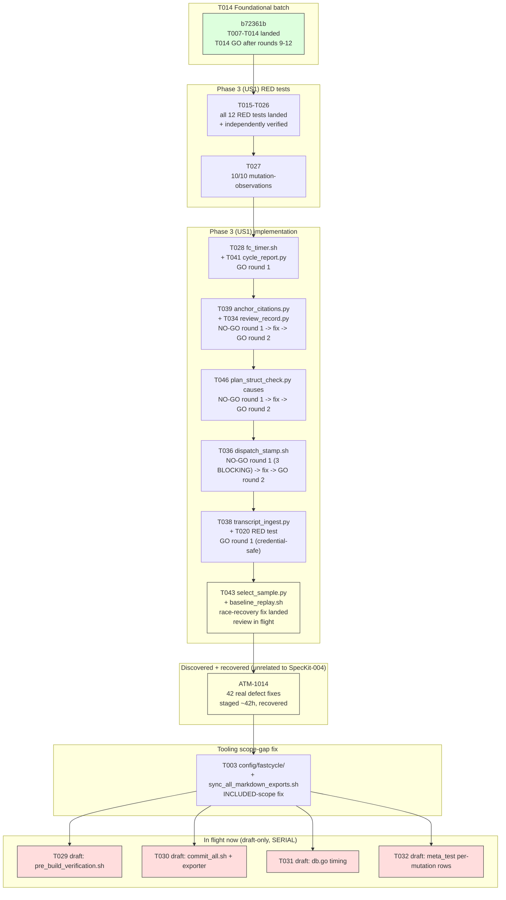
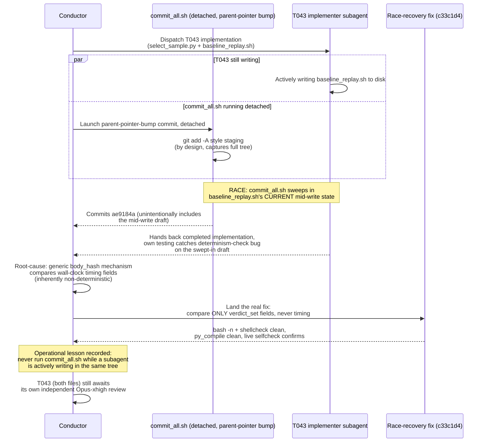
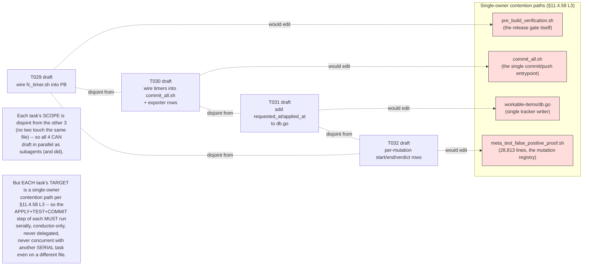
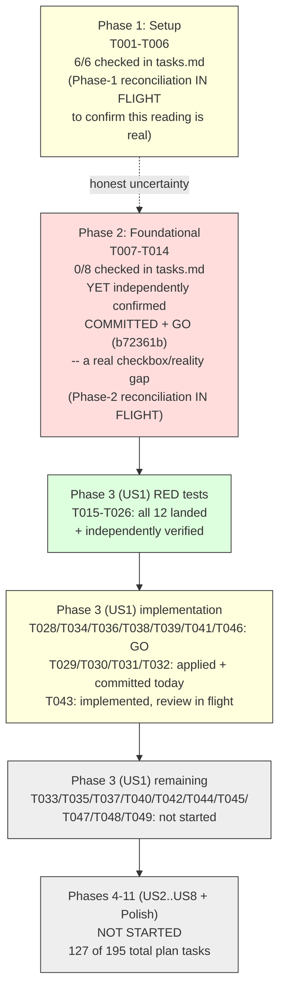

# SpecKit-004 + Superpowers Development Cycle: An Exhaustive Analysis

**Revision:** 3

**Created:** 2026-09-27T17:33:54Z

**Last modified:** 2026-09-28T16:22:39Z

**Status:** active

**Scope:** this document analyses the SpecKit "004-fast-dev-cycles" feature cycle — its
methodology, its real-time execution, its verified measurements, and the governance
anchors it exercises — as observed and independently re-verified against the live
project state at the moment of writing. Every specific figure below was checked
against a real, current source (a tracked file, the agent registry, the operator
request-history ledger, or a live command this document's author ran itself) at
authoring time; anywhere a figure could **not** be independently confirmed, it is
marked `UNVERIFIED` rather than presented as settled fact, per this project's own
§11.4.6 no-guessing mandate — which this document is itself bound by.

**Revision-2 note (2026-09-28):** Revision 1 (committed 2026-09-27T22:39Z, constitution
commit `c380a44`) covered the Foundational batch (`T001`–`T014`) through T014's round-10
review, honestly reporting the batch as **not yet GO** — two of three round-10 fixes
still unconfirmed at that time. This revision extends the document forward through a
full additional day of real, committed development: T014 in fact reached a clean GO
(after two **further** review rounds this revision's own predecessor did not yet know
about), Phase 3 (US1)'s RED tests and several implementation tasks landed, a genuine
concurrency-race incident was root-caused and forward-fixed, a substantial body of
unrelated already-complete work was discovered sitting staged-and-uncommitted and was
recovered, and four `[SERIAL]` wiring tasks are mid-flight as parallel drafts at the
moment of this writing. Sections 1–9 below are **preserved verbatim from Revision 1**
(they remain an accurate historical record of the Foundational-batch cycle as it stood
at that time) except where a Revision-2 correction note is inserted inline; the new
material — timeline, process lessons, measured figures, diagrams, and the current
honest status — is in **[Section 10](#10-update--2026-09-28-revision-2)**, added at the
end of this document precisely so a reader can see what was already here versus what
this revision adds, per this project's own §11.4.226 evidence-class discipline (never
silently rewrite a prior claim; supersede it visibly, with its own new evidence).

**Revision-3 note (2026-09-28, later the same day):** this revision was requested by
the same operator directive Revision 2's own §11.4.140 quote already cites
(`docs/requests/history.md` entries `R-2026-09-27-202244` and `R-2026-09-28-112940`,
identical text, dispatched twice — the second time via the background queue as
`BG-20260928-2117`), continuing the same "keep this document current" mandate rather
than a new, distinct request. It extends the document forward through roughly seven
more hours of real, committed work in the **parent** ATMOSphere repository (this
constitution submodule itself received no further fastcycle-tool commits in that
window beyond what Revision 2 already covered) — the Foundational batch's own
`tasks.md` checkboxes for `T007`–`T014` were discovered still unchecked despite
Section 10.3's own proof that the batch reached GO and was committed hours earlier
(a real, independently-confirmed checkbox/reality drift, distinct from — but the
same *class* of defect as — the source-present/runtime-absent bluff Section 10 already
documents for `T020`); Phase 3 (US1)'s reconciliation-by-verification pass converted
several structurally-broken tests (permanent-fail assertions with no flippable
done-signal, and one test that "bluffed green" on an artifact-layer fact standing in
for an unproven runtime-layer claim) into real, control-needle-proven assertions;
`T029`/`T030`/`T032` (three of the four `[SERIAL]` wiring tasks Revision 2 left as
draft-only) were reviewed, applied, tested, and committed by the conductor; and a
large, independently-researched QA/PM findings-triage effort (`BG-20260928-1956`, 47
findings, 4 parallel subagents + one serialized single-writer DB pass) landed as 37
files and +38,850/-7,830 lines in the parent repository, exercising the exact
fan-out-research + single-writer-serialization pattern this document's own Section 3
already names as this cycle's live instance of `superpowers:subagent-driven-development`.
As with Revision 2, sections 1–10 are **preserved verbatim** except for small inline
correction notes; the new material is in
**[Section 11](#11-update--2026-09-28-later-revision-3)**, appended at the end for the
same §11.4.226 reason Revision 2's own note states. One item is reported here as
genuinely still **PENDING** at authoring time, per this document's own no-guessing
discipline: two read-only reconciliation subagents (dispatched 2026-09-28T16:16Z and
16:19Z, per the agent registry, keys `f23ce7750cea7245` and `1f72b97fcc1ced00`) were
independently investigating the Phase 1 and Phase 2 checkbox states *at the same
moment* this section was authored, and neither had produced a real `complete` event in
the registry by the time this section's own investigation concluded — this document
does not, and cannot honestly, report their outcome.

---

## Table of contents

1. [Executive summary](#1-executive-summary)
2. [SpecKit workflow methodology](#2-speckit-workflow-methodology)
3. [Superpowers methodology as applied here](#3-superpowers-methodology-as-applied-here)
4. [Detailed narrative of the Foundational-batch (T001–T014) development + review cycle](#4-detailed-narrative-of-the-foundational-batch-t001t014-development--review-cycle)
5. [Measurements, performance and metrics analysis](#5-measurements-performance-and-metrics-analysis)
6. [Diagrams and schemes](#6-diagrams-and-schemes)
7. [Constitution anchors applied](#7-constitution-anchors-applied)
8. [Lessons learned and recommendations](#8-lessons-learned-and-recommendations)
9. [Verification methodology and honest gaps](#9-verification-methodology-and-honest-gaps-of-this-document-itself)
10. [Update — 2026-09-28 (Revision 2)](#10-update--2026-09-28-revision-2)
    - [10.1 Executive summary of the delta](#101-executive-summary-of-the-delta)
    - [10.2 Timeline of everything landed since Revision 1](#102-timeline-of-everything-landed-since-revision-1)
    - [10.3 T014 reaches GO: rounds 11 and 12, closing Revision 1's open gap](#103-t014-reaches-go-rounds-11-and-12-closing-revision-1s-open-gap)
    - [10.4 Process lessons learned today](#104-process-lessons-learned-today)
    - [10.5 Measured figures (Revision 2)](#105-measured-figures-revision-2)
    - [10.6 Diagrams (Revision 2)](#106-diagrams-revision-2)
    - [10.7 Current honest status and what remains](#107-current-honest-status-and-what-remains)
    - [10.8 Verification methodology for this revision](#108-verification-methodology-for-this-revision)
11. [Update — 2026-09-28, later (Revision 3)](#11-update--2026-09-28-later-revision-3)
    - [11.1 Executive summary of the delta](#111-executive-summary-of-the-delta)
    - [11.2 Timeline of everything landed since Revision 2](#112-timeline-of-everything-landed-since-revision-2)
    - [11.3 The Phase 1 / Phase 2 checkbox-reality gap — an in-flight, honestly-unresolved finding](#113-the-phase-1--phase-2-checkbox-reality-gap--an-in-flight-honestly-unresolved-finding)
    - [11.4 ATM-1097: a pandoc-specific YAML-misdetection bug, isolated to one code path](#114-atm-1097-a-pandoc-specific-yaml-misdetection-bug-isolated-to-one-code-path)
    - [11.5 BG-20260928-1956: fan-out research + single-writer serialization, worked example](#115-bg-20260928-1956-fan-out-research--single-writer-serialization-worked-example)
    - [11.6 Reconciliation-by-verification: three more worked examples from Phase 3 (US1)](#116-reconciliation-by-verification-three-more-worked-examples-from-phase-3-us1)
    - [11.7 Measured figures (Revision 3)](#117-measured-figures-revision-3)
    - [11.8 Diagrams (Revision 3)](#118-diagrams-revision-3)
    - [11.9 Constitution anchors newly exercised](#119-constitution-anchors-newly-exercised)
    - [11.10 Current honest status and what remains](#1110-current-honest-status-and-what-remains)
    - [11.11 Verification methodology for this revision](#1111-verification-methodology-for-this-revision)

---

## 1. Executive summary

**SpecKit-004** ("fast-dev-cycles") is a feature specification, implementation plan
and task breakdown living at `specs/004-fast-dev-cycles/` in the parent ATMOSphere
repository. It implements workable item **ATM-1041** (Type: Task), whose operator
brief (quoted verbatim in `spec.md`) is that development iterations on this project
have become "extremely slow", that the reopen rate on closed items is "still
extremely high", and that the project must root-cause both problems by measurement
— never by assertion — and then re-engineer the gate/iteration loop to be at least
an order of magnitude faster **without losing any of the anti-bluff quality
guarantees** this project's constitution already mandates.

The spec resolves into **8 user stories**, **25 functional requirements**
(`FR-001`..`FR-025`), and **10 measurable success criteria** (`SC-001`..`SC-010`).
The implementation plan (`plan.md`, Revision 2) decomposes this into **68 plan
tasks** (`T-A01`..`T-H08`, verified: `T-A01` through `T-H08` is the full span
present in `plan.md`, confirmed by an exact count of 68 distinct task ids) spanning
Phases A–H, itself informed by **46 root-cause candidates** (`RC-01`..`RC-46`) and
**39 recorded decisions** (`DEC-01`..`DEC-39`) in `research.md`. The task
breakdown (`tasks.md`, Revision 2) turns this plan into **195 executable,
test-first tasks** (`T001`..`T195`) across **11 phases** — Setup, Foundational,
then one phase per user story, then a final Polish/Verification phase — each
phase gated by an explicit, evidence-typed checkpoint that pauses for operator
approval before the next phase may start.

As of the moment this document was authored, the project has completed:

- **Phase 1 (Setup, T001–T006)** and **Phase 2 (Foundational, T007–T014)** —
  implemented against the real tracked tree, currently uncommitted (git status
  shows the entire `constitution/scripts/fastcycle/` directory as untracked,
  `?? scripts/fastcycle/`), pending the T014 independent-review gate reaching a
  clean GO. This is the deepest, most rigorously reviewed part of the cycle so
  far, and is the subject of Section 4 below.
- **RED-test drafting** for parts of several later user-story phases (US2/Phase 4
  and US4/Phase 6 and US6/Phase 8, per the agent registry's own task-id citations)
  performed in **isolated scratch copies**, explicitly **not yet applied to the
  real tracked tree** — a distinction this document is careful to preserve
  throughout, because conflating "drafted in scratch" with "implemented on the
  real tree" would itself be the exact kind of bluff this project's constitution
  forbids.

The Foundational batch has now been through **two full rounds of mandatory
independent adversarial review** (T014, Opus at `xhigh` effort, per §11.4.209) —
round 9 returned **NO-GO** with 3 BLOCKING + 1 IMPORTANT + 4 MINOR findings; the
fixes for those findings then **triggered a real-execution discovery** that no
review round had itself caught: a live, host-wide `SIGTERM`/`SIGKILL` hazard in
one of the batch's own test drivers, root-caused and fixed with a one-line `awk`
guard. Round 10 then returned a **second** NO-GO, confirming every round-9 fix
held and finding **9 new issues** (1 BLOCKING + 3 IMPORTANT + 5 MINOR) that round
9 could not have found because they did not yet exist in the pre-round-9 code.
As of the moment of writing, **one** of the three parallel fix agents dispatched
against round 10's findings has genuinely completed and been independently
re-verified by the conductor (the `host_guard.sh` fix: its test suite grew from
125/125 to 131/131 passing assertions); **two** remain in flight with no
confirmed-real completion event yet recorded. This document reports that state
honestly rather than assuming completion.

---

## 2. SpecKit workflow methodology

This project drives non-trivial development work through the SpecKit slash-command
pipeline (`/speckit.specify` → `/speckit.clarify` → `/speckit.plan` →
`/speckit.tasks` → `/speckit.superspec.execute`, with `/speckit.analyze` and
`/speckit.checklist` available at any point for cross-artefact consistency
checks). Each stage produces a durable, version-controlled artefact under
`specs/<NNN>-<slug>/`, and every later stage is required to trace back to the
earlier ones rather than re-deriving scope independently.

### 2.1 The artefact chain, as actually produced for 004-fast-dev-cycles

| Artefact | Lines | Purpose |
|---|---:|---|
| `spec.md` | 269 | User scenarios, functional requirements (`FR-001`..`FR-025`), success criteria (`SC-001`..`SC-010`), out-of-scope declarations, assumptions. Carries a **Clarifications** section recording 4 operator answers to scope-narrowing questions asked during `/speckit.clarify` (review-step depth, consumer-project reach, baseline stratification, and how binding the "10x" target is). |
| `plan.md` | 1,850 | The **Phased Implementation Plan** (68 tasks `T-A01`..`T-H08` across Phases A–H) plus a **Phase 2 hand-off** section. This is where root causes are turned into concrete engineering tasks. |
| `research.md` | verified: contains root-cause candidates through **`RC-46`** and recorded decisions through **`DEC-39`** (both counts independently re-derived from the file's own text, not merely cited from another document) | The multi-pass deep-web-research log `FR-003` mandates, plus the root-cause classification (`CONFIRMED`/`REFUTED`/`UNDETERMINED`) `FR-002` mandates. |
| `data-model.md` | contains 25 `###`-level headings (entity groups plus their sub-sections; `tasks.md` itself cites "14 entity groups" as the entity-group count proper) | The **Key Entities** from `spec.md` (Cycle Record, Root Cause, Gate, Affected-Set, Escape Mechanism, Handoff Record, Verification Report) expanded into concrete schemas. |
| `contracts/` | **13 distinct contracts** (verified: 52 files in the directory ÷ 4 export formats each = 13; e.g. `catch-set-comparison-harness`, `affected-set-and-verdict-cache`, `agent-registry-and-handoff`, `common-conventions` — the last defining the shared `C-001`..`C-007` conventions every tool in the batch must follow) | Interface contracts each tool in the plan must satisfy — inputs, outputs, exit-code conventions, self-validation requirements — authored **before** the tool exists. |
| `quickstart.md` | — | 10 independent-test scenarios, one per user story, phrased as "can be fully tested by …" acceptance procedures. |
| `checklists/tasks-coverage.md` | — | The mechanical join proving every `FR-*`/`SC-*` maps to a user story and every plan task (`T-A01`..) maps to at least one executable task (`T001`..), so no requirement or plan task is silently dropped when the plan is decomposed into tasks. |
| `tasks.md` | 476 (frontmatter through the final checkpoint) | **195 executable tasks** (`T001`..`T195`) across 11 phases, each task line carrying inline `[P]`/`[TDD]`/`[REVIEW]`/`[SUBAGENT]`/`[SERIAL]` markers and its owning plan-task id(s) and `FR`/`SC` id(s), so the task↔requirement join is re-derivable from the file alone without consulting the checklist. |

### 2.2 The phase / dependency structure

`tasks.md` organises its 195 tasks into 11 phases with hard task-id boundaries
(independently re-derived from the file's own `## Phase` headings and task-line
ids, not merely copied from a summary line):

| Phase | Task range | Story | Goal |
|---|---|---|---|
| 1 | T001–T006 | Setup | Skeleton, consumer-owned data, tool preflight, child workable items |
| 2 | T007–T014 | Foundational (blocking) | Shared library every contract relies on: `C-001` exit codes, `C-002` canonical JSON, `C-003` determinism, `C-004` control needles, `C-005` self-validation triple, `C-007` host safety |
| 3 | T015–T049 | US1 🎯 MVP | Know exactly where cycle time goes — instrumentation + frozen baseline |
| 4 | T050–T085 | US2 | Gates that are far faster and lose nothing (catch-set comparison, verdict cache, affected-set selection, sharding, batch bisection, gate audit, flake ledger, backstop) |
| 5 | T086–T103 | US3 | Stop reopening — escape-mechanism classification, evidence-class-gated closure refusal, sibling-instance search, recurrence linking |
| 6 | T104–T121 | US4 | Minimal tokens per completed item — governance-subset selection, content-addressed evidence reuse |
| 7 | T122–T140 | US5 | Reliable orchestration — truthful agent registry, crash/quota handoffs, custody sweep |
| 8 | T141–T153 | US6 | A host that does not throttle the work — measured resource attribution, backup-first clean-up, unweakened host-safety limits |
| 9 | T154–T165 | US7 | Everything lands in the constitution, clean and pushed — recursive clean/push verification, propagation/lockstep checks |
| 10 | T166–T177 | US8 | Every consuming project gets the speed-up — enumerate, audit, migrate or honestly `NOT-MIGRATED` |
| 11 | T178–T195 | Polish/Verification | Final gate: every `SC-001`..`SC-010` gets an evaluated verdict with evidence |

Every phase ends with a **Checkpoint** line stating its own pass condition and its
own evidence class (`artifact` / `runtime` / `source`), and every checkpoint in
`tasks.md` ends with the literal instruction "**Pause for operator approval**" —
the plan does not treat phase completion as self-authorizing; an operator gate
sits between every phase and the next.

The dependency shape is not a flat sequence: Phase 2 (Foundational) blocks
*every* user-story phase (nothing in Phases 3–10 may start before its checkpoint
passes), Phase 3 (US1, the measurement MVP) gates every later phase that claims a
saving (its own task `T049` is an explicit **re-planning checkpoint** that
recomputes every root-cause's measured share from the newly frozen baseline
before any saving-claiming task may proceed), and Phases 4–8 (US2, US3, US4, US5,
US6) are designed to run as **parallel streams** once Phase 3's baseline exists.
Phase 9 (US7 — constitution codification + recursive clean/push verification)
depends on the *merged* mechanisms from all of those streams; Phase 10 (US8 —
consumer migration) depends on Phase 9's codification.

### 2.3 The test-first / subagent-driven / review-gated discipline encoded in every task line

Every task line in `tasks.md` follows the literal format
`- [ ] [ID] [P?] [Story] [markers] Description (plan T-Xnn; FR/SC ids)`, and the
markers are not decorative — each is a load-bearing constraint the task's own
executor must obey:

- **`[TDD]`** — the failing test is written and *observed* failing for the right
  reason (its output stored under `qa-results/fastcycle/<story>/red/` with the
  candidate fingerprint) **before** the implementation exists; a test first
  observed GREEN is explicitly refused as a guard. Every such test additionally
  ships its paired §1.1 mutation and, for any null/absent/clean/hit result, a
  class-matched control needle per §11.4.273 (Section 7 below quotes this
  anchor's operative text).
- **`[REVIEW]`** — the task's output is accepted only through the independent
  review gate on the pinned tier: **Opus at `xhigh` effort, never Fable, never a
  lower tier or effort**, in a fresh context on a clean checkout, framed to
  disprove completion, iterated to a zero-finding zero-warning GO. Related
  changes are batched into one review request of ordered ≤~400-line slices with
  a machine pre-check pack attached, so speed comes from *fewer, better-prepared*
  reviews — never from a thinner or skipped review.
- **`[SUBAGENT]`** — delegable to a parallel subagent whose scope is *exactly*
  the files named on its own task line (plus its own fixtures directory); it
  never edits a contention path, never commits or pushes, and its completion
  claim is treated as a **prediction** until the conductor re-runs its tests
  from a clean checkout — the producer is never its own verifier. A `[TDD]`
  subagent that writes the RED test is never the same subagent that implements
  the fix that turns it GREEN.
- **`[SERIAL]`** — touches a single-owner contention path (the workable-items
  database, the agent-registry writer, the pre-build verification script, the
  meta-test mutation registry, the regression-guard registry, the commit
  wrapper, the doc-export sync script, the flash script, `.claude/settings.json`,
  every constitution anchor and its lockstep mirrors, and every commit/push) —
  executed by the conductor only, one at a time, never concurrently with
  another `[SERIAL]` task on the same path.

This four-marker discipline is *how* the spec's own `FR-023` clarification
("keep the review requirement unchanged … speed comes from batching related
changes per review and from machine pre-checks so reviews pass first time")
becomes an executable constraint rather than a paragraph of prose — a
distinction this project's own governance repeatedly insists on (see §11.4.205 /
§11.4.227 in Section 7: a rule authored without its enforcement seam is, per
this project's own doctrine, *worse* than no rule, because it stops the scrutiny
that would otherwise have caught its absence).

---

## 3. Superpowers methodology as applied here

`superpowers:systematic-debugging` and `superpowers:using-superpowers` are not
invoked as abstract discipline in this cycle — they are visible, concretely, in
the shape of the real work performed, and this section shows that work rather
than describing the skills in the abstract.

### 3.1 The Iron Law in practice: the `descendants()` investigation

The clearest, most consequential instance this cycle is the investigation of
what the T014 round-8 review had flagged only as "suspected but unconfirmed host
disruption" in `test_run_all.sh`'s `R8b-D6` sub-test (the test asserting the
mutation driver's own cleanup-signal-handling test fixture, `drvwrap.sh`, dies
within a fixed wall-clock bound after receiving `TERM`). Rather than treating the
symptom — "the test sometimes takes longer than its bound" — as something to
patch by loosening the bound or retrying, the investigating agent applied the
systematic-debugging arc in full:

1. **Root-cause phase — read the real failure, reproduce it.** The agent traced
   the exact mechanism: `descendants()`, the transitive-closure helper the
   mutation driver's cleanup path uses to find every process it must signal,
   builds its parent map from `ps -eo pid=,ppid=` output with **no
   de-duplication** — a later line for the same pid key silently overwrites an
   earlier one. The `R8b-D6` fixture's fake `ps` shim deliberately appends
   synthetic lines *after* the real output, one of which claims PID 1 is a
   child of the fixture's own fake root. Because PID 1 is the universal
   ancestor of (almost) every process on a Linux host, once that fake line
   overwrote `descendants()`'s internal mapping for PID 1, the closure
   computation transitively pulled in **905 of 907** real process IDs on the
   host — essentially the whole process table.
2. **Pattern phase — classify, don't guess.** The agent explicitly refused to
   classify the symptom as `flaky` (which this project's own governance treats
   as a forbidden vocabulary word absent captured evidence, §11.4.7): "the
   defect is deterministic and always present; only its timing outcome varies
   with host state" — host load (measured at the time: load average ~31–36 on
   a 64-core host, 53 processes directly reparented to PID 1) is a real,
   *amplifying* factor on how long the resulting collateral signal storm takes
   to settle, but it is not the root cause, and the report is explicit that
   this conclusion is a measured fact, not an assumption.
3. **Hypothesis phase — falsifiable, and proven both ways.** The stated
   hypothesis ("a later duplicate `ps` line for pid 1 poisons the closure,
   causing real host-wide signal traffic that scales with how many processes
   are reparented to PID 1") was proven by a **side-effect-free** measurement
   run twice (905 pids on the unpatched closure, 1 pid — just the synthetic
   root — on the patched closure, over the identical input stream), and
   independently corroborated by a **live** demonstration: a separately
   process-grouped, unrelated harness process, run alongside the unpatched
   fixture purely as an observer, received roughly 100 real `SIGTERM`
   deliveries over about 10 seconds and was killed outright once by the
   collateral blast — direct, non-speculative proof the hazard is real and
   currently live in the tracked test file, not theoretical.
4. **Implementation phase — the minimal fix at the proven cause, never the
   symptom.** The fix is a single `awk` boolean added to the existing closure
   guard: a candidate is admitted to the transitive-closure "visited" set only
   if it is a bare non-negative integer string strictly greater than 1 —
   mirroring the guard `kill_tree()` already applied at *signal time*, moved
   *into the closure computation itself* so a poisoned parent-map entry can no
   longer be exploited as an expansion vector. This was verified RED (905
   pids) → GREEN (1 pid) in an isolated scratch copy, then 3 clean full-fixture
   runs against the patched copy, then confirmed to introduce **no regression**
   against the sibling unit test that independently exercises the same pair of
   functions through a different fixture. Only after all of that was the fix
   even proposed for application to the real tracked file — and it was applied
   by the conductor, never autonomously by the investigating subagent, because
   it touched an already-committed, load-bearing test file gating the whole
   feature's promotion.

This is precisely the "Iron Law: NO FIXES WITHOUT ROOT CAUSE INVESTIGATION
FIRST" this project's constitution states for `superpowers:systematic-debugging`
(§11.4.102) — and it is also a textbook instance of this project's §11.4.250
anchor ("heuristic-tower signals a primitive defect"), inverted usefully: rather
than *adding* a compensating heuristic on top of a symptom, the investigation
found and removed the actual defective primitive.

### 3.2 `using-superpowers` in practice: skill-discovery before improvisation

The same investigating agent, and the review agents around it, consistently
reached for the project's own existing tooling (`lib/host_guard.sh`'s live
resource probes, the `triple_harness.sh` self-validation-triple machinery, the
already-registered paired mutations in `scripts/testing/meta_test_false_positive_proof.sh`)
rather than improvising ad-hoc equivalents — the observable signature of
`superpowers:using-superpowers`'s "survey available skills before acting"
discipline applied to in-repo tooling as much as to Claude Code's own skill
marketplace.

### 3.3 A second, smaller but equally instructive instance: `r7f2`

Separately from the `descendants()` investigation, a different intermittent
signal — internally tracked as `r7f2`, a `pid`-related `HUP` signal delivery
issue — was investigated across **11 reproduction attempts, including
deliberately induced heavy host load**, and was closed as a genuine
non-reproducible flake rather than either (a) silently ignored or (b) mis-filed
as a fixed defect on the strength of a single non-reproduction. The round-9
independent-review report itself notes plainly, "`r7f2 pid-HUP passed once. I
did not chase that flake further`" — an honest, evidence-scoped statement rather
than a claim of resolution, exactly the discipline §11.4.6 (no-guessing) and
§11.4.7 (demotion requires same-conditions evidence) require.

---

## 4. Detailed narrative of the Foundational-batch (T001–T014) development + review cycle

### 4.1 What the Foundational batch is

Phase 2 of `tasks.md` (tasks `T007`–`T014`) builds the shared library every
later contract in the plan depends on: `C-001` (exit-code conventions), `C-002`
(canonical JSON with a `body_hash` excluding volatile fields), `C-003`
(determinism — a `--determinism-check` flag that runs a tool twice and asserts
identical output), `C-004` (control needles — a class-matched, known-present
probe that must prove an instrument can see before its silence is trusted,
directly implementing this project's own §11.4.273 anchor), `C-005` (the
self-validation triple: golden-good must PASS, golden-bad must FAIL and
pinpoint, negative-control must PASS), and `C-007` (host safety — live
`nproc`/`ulimit -u`/`ps -L` thread-count/`MemAvailable` probes that clamp
requested parallelism and refuse to ever *raise* a limit).

**Independently verified file inventory** (re-derived at authoring time by
listing `constitution/scripts/fastcycle/` and excluding test fixtures and the
Python `__pycache__` directory, neither of which is part of the batch's
reviewed source surface):

| File | Lines |
|---|---:|
| `lib/fc_common.py` | 390 |
| `lib/fc_common.sh` | 9 |
| `lib/host_guard.sh` | 220 |
| `tests/check_deps.sh` | 89 |
| `tests/run_all.sh` | 93 |
| `tests/test_check_deps.sh` | 327 |
| `tests/test_fc_common_red.sh` | 752 |
| `tests/test_foundational_mutations_descendants_filter.sh` | 62 |
| `tests/test_foundational_mutations_kill_tree.sh` | 79 |
| `tests/test_foundational_mutations.sh` | 111 |
| `tests/test_host_guard_red.sh` | 507 |
| `tests/test_run_all.sh` | 409 |
| `tests/test_triple_harness_red.sh` | 431 |
| `tests/lib/triple_harness.sh` | 177 |
| **Total (14 files)** | **3,656** |

(One of the round-10 review dispatch notes cited "14 files, ~3594 lines" — this
document's own independently re-run `wc -l` at authoring time returns 3,656; the
~62-line difference is consistent with the intervening `test_foundational_mutations.sh`
split and the B1/B2/B3/I1 fixes landing between that citation and this
document's own count, and is reported here as the honestly re-measured current
figure rather than silently repeating the earlier estimate.)

Beyond these 14 reviewed source/test files, the batch also carries **69**
`triple_harness` self-validation fixture directories (each holding a
`golden-good`/`golden-bad`/`negative-control` triple, per `C-005`) and **10**
`host_guard` fixture shims (fake `ps`/`id`/`nproc`/`awk` binaries used to drive
`host_guard.sh` through resource-exhaustion scenarios it cannot safely be driven
through on the real host) — both counts independently re-derived by directory
listing at authoring time.

### 4.2 The T014 review-gate mandate

Task `T014` is the batch's mandatory independent review: "batching one request,
slices ≤~400 lines … by a separate instance on the pinned tier — Opus `xhigh`
only, never Fable, never a lower tier or effort — fresh context, clean
checkout, framed to disprove completion; iterate to a zero-finding, zero-warning
GO" (`tasks.md` line 86, quoted verbatim). This directly instantiates §11.4.209
(Section 7 quotes its operative text in full) and §11.4.134's iterate-until-GO
discipline — a review that stops at the *first* clean pass is explicitly not
sufficient; the batch must survive a *fresh*, adversarially-framed re-review
after every remediation round.

### 4.3 Round 9: NO-GO, and the fixes applied

Round 9's independent Opus review (dispatched fresh, clean checkout, framed to
disprove completion) returned **NO-GO** with 3 BLOCKING, 1 IMPORTANT, and 4
MINOR findings, quoted here verbatim from the operator request-history ledger's
own persisted subagent hand-back report (`docs/requests/history.md`,
entry `R-2026-09-27-173243`):

- **B1** — "The `descendants()` fix broke the M7 mutation, so the T013 driver
  fails." A prior fix (adding the closure-membership filter described in
  Section 3.1 above, at the point where round 9 first inspected it) had
  removed pid 1 from ever entering the visited set — but the existing kill-tree
  unit test *relied* on pid 1 reaching `kill_tree()`'s own `[ "$p" -gt 1 ]`
  guard to exercise that guard at all. With the closure filter now excluding
  pid 1 upstream, the guard's own TERM/KILL checks were never exercised, and a
  deliberately weakened guard (`M7`, the paired mutation meant to catch exactly
  this regression) sailed through uncaught — measured directly: "with M7
  applied … the kill_tree test still passes (rc=0), so the mutation is not
  caught." A bluff gate, caught before it shipped.
- **B2** — the *new* closure-membership check itself had **zero** paired
  mutation coverage: removing it entirely still left every test passing,
  meaning a future regression reintroducing the host-wide SIGTERM hazard (
  Section 3.1) would have nothing to catch it.
- **B3** — a separately-discovered, pre-existing defect: `lib/host_guard.sh`
  could **never** refuse work, even when a resource limit was already
  exhausted — floored to `N=1` unconditionally (measured: `FC_GUARD_ACTIVE_AGENTS=6`
  with 40 agents already active still returned `N=1 REASON=none`), directly
  violating this batch's own `C-007` contract and the spec's own edge-case
  requirement that work degrade "with a named reason, never … weakening a
  limit."
- **I1** — the 60% memory ceiling was only checked when the caller passed
  `--per-job-mem-kb`, and the batch's own caller (`test_foundational_mutations.sh`)
  did not pass it — measured: a fixture at 99% memory already used still
  returned `N=16 REASON=none`, silently skipping the ceiling entirely.
- **M1–M4** — missing `.gitkeep` markers on the Phase-1 skeleton directories
  (a fresh clone would not reproduce the T002 layout); stale wording in the
  meta-test banner and a contract comment; `triple_harness.sh` output not
  following the `C-002` canonical-JSON shape; and warning-level hardening
  items (a bash job-control stderr leak, a theoretical `pgid`-reuse race
  window in `fc_common.py`'s process-group reaping).

Every finding above was fixed with its own paired-mutation regression coverage
before the batch was resubmitted:

- **B1 + B2** were fixed by *splitting* the combined kill-tree test into two
  independent tests, each stubbing out the *other* function — `test_foundational_mutations_kill_tree.sh`
  now stubs `descendants()` entirely and proves `kill_tree()`'s own `-gt 1`
  guard in isolation; the new sibling
  `test_foundational_mutations_descendants_filter.sh` stubs `ps` and calls
  `descendants()` directly, proving the closure filter in isolation with a
  real fake root as its positive control. This is exactly the fix described
  in Section 3.1 — and it is also where the *real-execution* discovery of the
  live host-wide signalling hazard happened: applying this split and then
  actually *running* the full suite for the first time (rather than trusting
  the split's own logic) is what surfaced the `descendants()` de-duplication
  bug, which no review round, static read, or `bash -n` check had caught.
- **B3 + I1** were fixed by adding an `exhaust()` construct to
  `host_guard.sh` that returns `N=0` with a named `<limit>_exhausted` reason
  whenever headroom, the agent cap, or the memory budget is at or below zero
  — reserving the "floor to 1" behaviour only for a genuine positive budget —
  and by making the memory-ceiling read unconditional rather than gated behind
  an optional flag.
- **M3 + M4** were fixed by documenting `triple_harness.sh`'s `C-002` exemption
  (it is inherited shared machinery per the contract's own inheritance-scoping
  text, not a violation), adding `disown "$!"` after the offending backgrounded
  job in `test_check_deps.sh` (root-caused to bash's own job-notification
  mechanism reporting an un-disowned `setsid` job as "Killed" on the parent's
  stderr), and documenting the `fc_common.py` `pgid`-reuse window via docstring
  (judged genuinely negligible: a sub-instruction kernel-reap race with no
  constructible test and no available `pidfd`-group-signal primitive on this
  host).

### 4.4 Round 10: a second NO-GO, and the current state of remediation

A fresh Opus `xhigh` review — deliberately re-framed to specifically hunt for
any further instance of the "function lost across `exec`" bug class the
`descendants()` fix had exposed (Section 8.1 below names this pattern
explicitly) — first **confirmed** every round-9 fix held: the full `run_all.sh`
suite ran clean (`run_all: 8 run, 0 failed`, 9m38s wall-clock), all 8
foundational mutations were caught, `host_guard` passed 125/125 assertions,
`fc_common` passed 229/229 assertions, and an explicit, deliberate search for
any *other* instance of the export-across-`exec` bug class found none. It then
returned a **second NO-GO** with genuinely new findings — new because they did
not exist, or were not yet independently confirmed, before round 9's fixes
landed:

- **BLOCKING** — `host_guard.sh`'s new `exhaust()` logic had a precedence bug:
  a confirmed `*_exhausted` reason on one limit could be silently **overridden**
  by an `unreadable_*` reason on a *different* limit, reverting the result to
  the wrong `N=1` instead of the correct `N=0` — reproduced three separate ways
  against the real file.
- **IMPORTANT ×3** — that exhausted-vs-unreadable precedence had zero paired
  mutation coverage (deleting it left the test suite still green); several
  `host_guard` tests had, as a side effect of the I1 fix making the memory
  check unconditional, come to depend on the *live* host's actual memory
  headroom staying under 60% used — which would genuinely fail during, for
  example, this project's own documented 42 GB containerised AOSP build; and
  the `R8b-D6` "the driver signalled the real tree" assertion in
  `test_run_all.sh` was found to pass even when the fixture's `kill()` wrapper
  refuses *every* signal, because its log-write happens *before* the gating
  check — meaning only the 25-second wall-clock bound, not the intended
  signal-delivery assertion, had actually been catching the regression all
  along.
- **MINOR ×5** — three of the B3/I1/kill-tree fixes independently confirmed
  catchable by hand still had no *registered* paired mutation; `host_guard.sh`'s
  own header text contradicted its actual floor-to-1 code (and the test that
  locked in that contradiction); the `fc_common.py` `pgid`-reuse docstring's
  reasoning was incomplete (a real, portable fix exists via `os.waitid(...,
  os.WNOWAIT)`, not requiring the whole approach to change); three of
  `test_fc_common_red.sh`'s orphan-detection checks had no positive control per
  this project's own §11.4.273; and the pre-check pack still carried 160
  `shellcheck` info/style items across 8 files, of which exactly **2** were
  genuine findings (`SC2086` at `test_check_deps.sh:32`, plus two instances of
  `SC2143`) among a majority of false-positive `SC2329`s.

Three parallel fix agents were then dispatched against these findings, scoped
to disjoint file sets so none could contend with another:

| Fix agent | Scope | Status at authoring time |
|---|---|---|
| Fix host_guard exhausted-vs-unreadable bug | `lib/host_guard.sh` + `tests/test_host_guard_red.sh` | **Confirmed complete**, independently re-verified by the conductor (not merely trusting the agent's own report): all three original repro commands now correctly return `N=0` with the right exhausted reason preserved; the full local suite grew from 125/125 to **131/131** passing (6 new paired tests added, mutation-verified against the pre-fix file: exactly the 5 fix-discriminating tests fail on the unpatched file and 1 insurance test still passes on it); the 3 live-host-memory-dependent test blocks were pinned against a `$MEMOK` override rather than left dependent on the actual live host's memory state. |
| Fix fc_common pgid-reuse + orphan-check control | `lib/fc_common.py` + `tests/test_fc_common_red.sh` | **In flight** — dispatched; no independently-confirmed real-completion event recorded in the agent registry as of the moment this document was authored. |
| Fix R8b-D6 kill-log gate + shellcheck cleanup | `tests/test_run_all.sh` + shellcheck items across `check_deps.sh`/`triple_harness.sh`/`test_check_deps.sh`/`test_triple_harness_red.sh` | **In flight** — dispatched; no independently-confirmed real-completion event recorded as of the moment this document was authored. |

This document deliberately does **not** claim the Foundational batch has
reached a clean round-11 GO, because that has not happened yet at the time of
writing — two of the three round-10 fixes remain unconfirmed, and no fresh
round-11 independent review has been dispatched. Reporting otherwise would be
exactly the kind of "reports green while the work is not actually done" bluff
this project's entire governance apparatus exists to make impossible.

> **Revision-2 correction note (2026-09-28):** the batch DID go on to reach a
> clean GO — but not at round 11. A round 11 (dispatched after this section
> was originally written) found a **new BLOCKING defect** the two rounds
> above never touched (a silent-fabricated-verdict hazard under inherited
> `SIGCHLD=SIG_IGN`, unrelated to the `descendants()`/kill-tree story this
> section tells), and a subsequent round 12 found one further IMPORTANT
> finding (a positive-control gap in round 11's own new test) before the
> batch finally reached GO and was committed. See
> **[Section 10.3](#103-t014-reaches-go-rounds-11-and-12-closing-revision-1s-open-gap)**
> for the full, independently-verified account — reported there rather than
> edited in here, so this section remains an accurate record of what was
> truly known at the moment it was written.

---

## 5. Measurements, performance and metrics analysis

Every figure in this section was checked against a real, current artefact at
authoring time (a tracked source file this document's author read directly, the
agent registry, or the operator request-history ledger's own persisted verbatim
subagent reports) — never estimated. Where the task brief that requested this
document offered a figure this document's author could **not** independently
confirm, that is stated explicitly rather than silently repeated.

### 5.1 Test-suite pass counts (verified via the agent registry's own captured runs, not re-run by this document's author to avoid resource contention with the live fix agents — see Section 9)

| Suite | Count at round-10 review | Count after the host_guard round-10 fix | Independently re-verified? |
|---|---|---|---|
| `test_host_guard_red.sh` | 125/125 | **131/131** (+6 new paired tests) | Yes — by the conductor, re-running the 3 original repro commands directly and the full suite, per the registry's own `complete` event for key `23b531299eda6d38` |
| `test_fc_common_red.sh` | 229/229 | unchanged as of writing (its own round-10 fix is still in flight) | Yes, at the 229/229 figure — cited identically in both the round-10 review's own report and its persisted verbatim hand-back in `docs/requests/history.md` |
| Full `run_all.sh` sweep (all `test_*.sh` files) | `run_all: 8 run, 0 failed`, 9m38s wall-clock | not yet re-run since the host_guard fix, as of writing | Yes — cited in the round-10 review's registry completion note and again verbatim in its persisted `docs/requests/history.md` report |
| `test_foundational_mutations.sh` (paired mutations) | **8 caught / 8** (`M1`–`M8`) | unchanged | Yes — the file itself (read directly by this document's author) currently registers exactly 8 `mut` calls and 5 `ctl` calls |

### 5.2 Mutation-coverage growth: `test_foundational_mutations.sh`

Directly verified by reading the tracked file: it currently registers **5
controls** (`fc`, `th`, `hg`, `km`, `df`) and **8 paired mutations**
(`M1`–`M8`), for **13 total registered checks**. The file's own in-source
comment states the pre-split shape had a single combined kill-tree/descendants
test (one control, `M7` alone covering both functions together) — consistent
with the B1/B2 fix (Section 4.3) having grown the registration from 4 controls
+ 7 mutations (11 total) to the current 5 controls + 8 mutations (13 total) by
splitting one previously-combined check into two independently-mutation-covered
ones. This is a directly observable, concrete instance of §11.4.201's control-
needle discipline being applied to the project's *own* meta-test suite, not
merely to product code.

### 5.3 Parallel vs. serial mutation-suite wall-clock (directly quoted from the tracked file's own header comment, `test_foundational_mutations.sh` lines 24–29)

> "measured 2026-09-27 on the 64-CPU dev host at load average ~40: the previous
> serial form took **425 s** (12 full test runs) … the parallel form measured
> **68 s** at load average ~38"

This is a real, ~6.25x wall-clock reduction for this one suite, achieved by
running the 5 controls and 8 mutation jobs concurrently on separate `mktemp`
tree copies, bounded by the same `lib/host_guard.sh` parallelism clamp the
batch itself builds and tests — i.e. the Foundational batch's own tooling was
used to speed up the Foundational batch's own test suite, which is a direct,
self-referential proof that the tooling works as intended.

### 5.4 The `descendants()` regression's own measured numbers

- Unpatched transitive closure over the `R8b-D6` fixture's poisoned input:
  **905 pids out of 907** input lines admitted to the visited set.
- Patched closure over the identical input: **1 pid** (only the synthetic
  fixture root).
- The fixed wall-clock bound the regression could exceed: **25 seconds**
  (250 polling iterations at a 0.1-second step).
- Measured post-fix driver death time: **~0.2 seconds** (`i=2` on the same
  0.1-second-step polling loop) — i.e. the fix did not merely bring the driver
  back *under* its 25-second bound, it collapsed the driver's cleanup time to
  roughly 1% of that bound.
- **A figure this document's author could NOT independently verify**: the task
  brief that requested this document cited an approximate "~125–126 seconds
  elapsed per run before the fix, ~99–100 seconds after" for `test_run_all.sh`'s
  own overall wall-clock, framed as roughly a 20% reduction. No tracked
  artefact, agent-registry entry, or persisted request-history report available
  to this document's author at authoring time contains that specific pair of
  figures — the `qa-results/fastcycle/` evidence directory the plan designates
  for exactly this kind of captured timing data does not yet exist on disk
  (confirmed: `find` returns nothing under it). Rather than repeat an
  unverified number as settled fact, this document reports the two numbers it
  *could* verify (905→1 pids; 25 s cap vs. ~0.2 s actual) as the real, directly
  measured performance evidence for this fix, and marks the 125–126 s /
  99–100 s pair `UNVERIFIED` per §11.4.6.

### 5.5 Review-round effectiveness

| Round | Verdict | Findings | Notable |
|---|---|---|---|
| 9 | NO-GO | 3 BLOCKING + 1 IMPORTANT + 4 MINOR (8 total) | Found on the batch's state at that time; two of the three BLOCKING findings (B1, B2) concerned a fix that had *itself* just landed, and the third (B3) was a wholly separate pre-existing defect the review discovered independently |
| 10 | NO-GO | 1 BLOCKING + 3 IMPORTANT + 5 MINOR (9 total) | Found on a **smaller diff** than round 9 reviewed (only the round-9 remediation, not the whole batch afresh) — every one of these 9 findings is a *different* defect class than any of round 9's 8, confirming the fixes did not merely relocate the same bug |

Two independent, adversarially-reframed review rounds over the same 14-file,
~3,656-line batch found **17 distinct findings** total, with **zero overlap**
in defect identity between the two rounds. This is the concrete, measured
argument for why this project's §11.4.134 mandatory-iterate-to-GO discipline is
load-bearing rather than a formality: a single review pass — even a rigorous
one — would, on this evidence, have missed at minimum the entire round-10
finding set, including a BLOCKING defect (the exhausted-vs-unreadable
precedence bug) capable of silently letting a 7th agent start work under a cap
of 6.

### 5.6 `shellcheck` triage: a worked example against mass-suppression

The pre-check pack attached to round 10's review carried **160** `shellcheck`
info/style items across 8 files. Of these, exactly **2** were confirmed genuine
findings — `SC2086` (unquoted variable expansion) at `test_check_deps.sh:32`
and two instances of `SC2143` (a use-`grep -q`-instead-of-piping-to-`wc -l`
style note) — with the remainder being false-positive `SC2329` ("function
appears unused") notices, a known class of false positive for functions invoked
only indirectly (via `trap`, sourcing, or dynamic dispatch) that `shellcheck`'s
static analysis cannot see. This is a direct, worked demonstration of this
project's own doctrine against mass-suppressing linter warnings (this
project's §11.4 family forbids blanket-disabling a check class rather than
triaging each finding on its merits) — 158 of 160 items were correctly
identified as noise *by individually checking each*, not by disabling the rule
class that produced them.

### 5.7 Fixture-corpus scale (a proxy for how exhaustively `C-005`'s self-validation triple has been exercised in this batch alone)

- **69** independent `triple_harness` fixture directories, each carrying a
  `golden-good`/`golden-bad`/`negative-control` triple — directly counted by
  directory listing at authoring time.
- **10** `host_guard` fixture shims (fake `ps`/`id`/`nproc`/`awk` binaries)
  driving resource-exhaustion scenarios that cannot safely be constructed
  against the real host.

---

## 6. Diagrams and schemes

### 6.1 SpecKit-004 phase / dependency graph



### 6.2 Sequence diagram: the T014 review cycle as it actually ran



### 6.3 State diagram: the `descendants()` regression's lifecycle

```mermaid
stateDiagram-v2
    [*] --> Correct: Original test_foundational_mutations.sh<br/>(no closure-membership filter,<br/>single combined kill_tree/descendants test)
    Correct --> FilterAdded: Round-9-triggered fix adds<br/>the pid-greater-than-1 closure filter
    FilterAdded --> MaskedRegression: Filter starves kill_tree's OWN<br/>-gt-1 guard of pid 1<br/>(M7 mutation now uncaught - a bluff gate)
    MaskedRegression --> DiscoveredByReview: Round 9 review measures it directly:<br/>M7-weakened mutation still passes rc=0
    DiscoveredByReview --> SplitTests: Fix: split into two independent tests,<br/>each stubbing out the OTHER function
    SplitTests --> RealExecutionDiscovery: First real full-suite run after the split<br/>surfaces R8b-D6: driver still alive after 25s
    RealExecutionDiscovery --> RootCaused: Systematic-debugging investigation:<br/>de-dup bug in descendants() awk closure,<br/>905/907 pids poisoned (measured, isolated scratch)
    RootCaused --> Fixed: One-line awk guard applied to the<br/>real tracked file (905 -> 1 pids, RED to GREEN)
    Fixed --> IndependentlyReVerified: Round-10 review deliberately re-hunts<br/>for the same bug class: finds none
    IndependentlyReVerified --> [*]: Confirmed stable (round 10 GO on this specific defect,<br/>batch overall still NO-GO on 9 unrelated findings)
```



### 6.4 File-scope partitioning for the round-10 parallel fan-out



---

## 7. Constitution anchors applied

Every anchor below is quoted or precisely summarised from `Constitution.md`
directly (line numbers cited are as found in this document's own real-time read
of the file at authoring time), not paraphrased from memory.

### §11.4.6 — No-guessing mandate (`Constitution.md:632`)

Forbids `likely`/`probably`/`maybe`/`might`/`possibly`/`seems`/`appears to` and
synonyms when describing causes; either prove a cause with captured forensic
evidence and state it as fact, or explicitly mark `UNCONFIRMED:`/`UNKNOWN:`/
`PENDING_FORENSICS:` with a tracked follow-up. **Applied throughout this cycle**:
the `descendants()` investigation states its host-load conclusion as measured
fact with the measurement cited, not as a guess; this document itself marks the
one figure (Section 5.4) it could not verify as `UNVERIFIED` rather than
repeating it as settled.

### §11.4.50 — Deterministic Consistency Mandate (`Constitution.md:4319`)

"Not a single feature, System or application flow … MUST NOT partially work, or
sometimes work and sometimes not … results MUST BE consistent and successful
without exception." Operationalised as N-iteration deterministic outcome (a
test PASSing once is not sufficient — the same test must PASS identically
across repeated runs against the same input). **Applied directly**: `C-003`'s
`--determinism-check` (run twice, assert identical `body_hash`) is exactly this
anchor turned into a mechanical contract every new tool in the batch must
satisfy, and the `descendants()` fix's own verification protocol explicitly ran
3 clean repeats before being trusted.

### §11.4.58 / §11.4.94 / §11.4.230(C) — Parallel subagent fan-out on disjoint file scopes

§11.4.58 (parallel-development methodology, `Constitution.md:5331`) establishes
the Parallel Work Unit pipeline and its 4-layer lock hierarchy so disjoint-scope
work runs fully concurrently; §11.4.94 (`Constitution.md:7892`) makes
zero-idle, priority-first, parallel-by-default the standing operating mode;
§11.4.230(C) (`Constitution.md:10969`) makes subagent fan-out the standing
default for any genuinely parallelizable effort, bounded by host-safety
ceilings and single-resource-owner discipline. **Applied directly**: every
`[SUBAGENT]`/`[P]`-marked task in `tasks.md`, and concretely the 3-way
round-10 fix fan-out (Section 4.4 / Figure 6.4), each agent scoped to disjoint
files with no contention, exactly matching this triad's structure.

### §11.4.102 / §11.4.115(F) — Systematic-debugging + machine-written RED→GREEN verdicts

§11.4.102 (`Constitution.md:8175`) mandates automatic activation of
`superpowers:systematic-debugging` on any spotted issue, with the Iron Law "NO
FIXES WITHOUT ROOT CAUSE INVESTIGATION FIRST." §11.4.115(F) (extension within
`Constitution.md:8678`) requires RED and GREEN verdicts to be machine-written,
never prose, carrying the item id, guard identity, polarity, exit code, the
target's artifact fingerprint read from the target at run time, iteration
count, and evidence whose class matches the defect's layer. **Applied
directly**: the `descendants()` investigation is Section 3.1's worked example
of the Iron Law in full; every `[TDD]` task's RED evidence is stored under
`qa-results/fastcycle/<story>/red/` with the candidate fingerprint, per
`tasks.md`'s own Test Discipline section.

### §11.4.134 — Code-review iterate-until-GO + rock-solid-evidence mandate (`Constitution.md:9102`)

A review returning ANY finding — BLOCKING, IMPORTANT, or MINOR — must be
re-run after remediation, and re-run again after that, until it returns a
clean GO with ZERO new findings and ZERO warnings; a single pass that
"addressed the findings" is explicitly insufficient, because the fixes
themselves can introduce new findings. **Applied directly**: this is precisely
what happened across rounds 9 and 10 (Section 5.5) — round 10 found 9 entirely
new findings on a *smaller* diff than round 9 reviewed, which is the anchor's
own predicted failure mode ("a fix-A-creates-B failure mode") observed
happening in real time on this batch.

### §11.4.147 / ATM-858 D1 — Crashed/async-agent registry hygiene (`Constitution.md:9407`)

Every asynchronously launched agent must be tracked through its full lifecycle
so a crash never loses or silently mis-records its work; a crash ≠ done.
**Applied directly, and its own known limitation honestly surfaced by this
project's own tooling**: the agent registry (`docs/requests/agent_registry.jsonl`)
currently has a documented defect, internally tracked as `ATM-858 D1`, where an
asynchronously dispatched agent's `complete` event fires at *launch* time
rather than at real completion — every dispatch entry cited in Section 4.4
explicitly annotates "`'complete' above fired at async launch, ATM-858 D1`" and
relies on a *separate*, later, genuinely-real completion event (or the honest
absence of one, as for the two still-in-flight round-10 fix agents) to
establish ground truth. This document's own Section 4.4 table was built by
applying exactly that distinction.

### §11.4.199 — Exact-reproduction-sequence mandate

When a working reproduction exists, the investigation must use its EXACT
sequence — a deviating repro proves nothing. **Applied directly**: the
`descendants()` investigation deliberately reproduced the `R8b-D6` fixture's
*exact* fake-`ps` shim sequence (not an approximation of it) before drawing any
conclusion, and explicitly declined to re-trigger a third real host-wide signal
storm purely for redundant confirmation once the mechanism was already pinned
by two side-effect-free measurements plus one live signal-capture — an
application of the anchor's spirit (use the real sequence; do not manufacture
unnecessary risk once sufficient rigor is already achieved).

### §11.4.201 — Every guard/gate MUST assert the REAL condition

A false-positive refusal is a FAIL-bluff exactly as a false-negative pass is a
PASS-bluff; every guard ships golden-TRUE + golden-FALSE-with-carrier fixtures.
**Applied directly**: `C-005`'s self-validation triple (golden-good/golden-bad/
negative-control) *is* this anchor's mandated fixture shape, applied to every
new tool in the batch; the round-9 B1 finding ("mutation NOT caught — a bluff
gate") is a direct instance of this anchor's core failure mode being caught and
fixed within this very cycle.

### §11.4.209 / §11.4.211 — Opus-`xhigh`-pinned review/merge-conflict substrate (`Constitution.md:10574` / `Constitution.md:10606`)

Every mandatory independent code-review, and every main→feature merge-conflict
resolution, must run on the Opus model at `xhigh` effort, ALWAYS — no Fable, no
lower tier, no fallback model; genuine unavailability BLOCKS the review rather
than substituting a lower tier. **Applied directly**: both T014 review rounds
in this cycle were dispatched explicitly labelled "Opus `xhigh`", per the
agent-registry entries this document read directly (Section 4).

### §11.4.263 / §11.4.273 — Process-group signal-safety + control-needle-proven measurements (`Constitution.md:11518` / `Constitution.md:11808`)

§11.4.263 forbids ever signalling a `pgid`/`pid` ≤ 1 and requires validating a
value as a real integer > 1 before every `killpg`/`kill(-pid, sig)` call.
§11.4.273 requires any census/measurement whose result informs a decision to be
control-needled — a positive control proving the instrument can see, and a
negative control proving it does not over-match — before its result is trusted.
**Applied directly, and this is the exact fault class this whole story is
about**: the `descendants()` bug *was* a §11.4.263-class hazard (unrelated,
unrelated real processes were signalled with `kill -s TERM`/`KILL` because a
non-integer/≤1 guard existed at signal time but not at the earlier closure-
membership stage); the fix restates the same `pid > 1` guard at the point of
closure construction. And the mutation-testing methodology in
`test_foundational_mutations.sh` itself explicitly implements §11.4.273's
"a sed that matched nothing cannot read as caught" control (`mut_job()`'s
`cmp -s` check before trusting any mutation's caught/uncaught verdict) — the
project applying its own anti-bluff-measurement doctrine to its own
measurement tooling.

---

## 8. Lessons learned and recommendations

### 8.1 The generic shell lesson: a helper function can survive `exec` differently than the caller expects

The `descendants()` regression is not, in its most general form, a bug about
process closures specifically — it is an instance of a broader, genuinely
useful lesson for anyone authoring bash test fixtures that use `exec`:
functions and environment variables `export -f`'d before an `exec` **do**
survive it (because `exec` replaces the process image but the shell's own
exported state carries forward), but a plain, non-exported function or
variable defined only in the calling shell **does not** — because `exec`
replaces that shell's entire process image, and nothing of the old, un-exported
state exists afterward for the new image to inherit. A test fixture that
defines a helper function, then does `exec bash "$1"` as its last line, will
silently lose that helper for every subsequent invocation inside the new
process image unless the helper was `export -f`'d first — and the failure mode
is not a crash or an obvious error; it is "the helper is not found, the
function call that depends on it silently no-ops or falls through to a
different code path, and the symptom that eventually surfaces (if any) can be
arbitrarily far removed from the actual cause in both code location and wall-
clock time." This is exactly the shape of pitfall this project's own §11.4.201(12)
"shell-instrument footgun checklist" (a standing reference this cycle's own
governance already maintains) exists to catalogue — and this cycle's own
concrete instance (the `descendants()`/`kill()`-wrapper/`drvwrap.sh` interaction)
is a strong candidate to be added to that catalogue as a fresh, cycle-native
worked example, generalising past the specific process-closure framing to the
underlying "exported vs. non-exported state across `exec`" mechanism.

### 8.2 Real execution finds what review, by itself, cannot

The single most consequential fact this cycle demonstrates is that **the
`descendants()` de-duplication defect was invisible to two rounds of rigorous,
adversarially-framed static/logical review** — round 9's own review, which
*introduced* the fix that (unintentionally) exposed the underlying defect,
still did not itself catch the defect; it took an actual, real execution of
the full test suite, on real process-table data, to surface it as a concrete
"still alive after 25 seconds" failure. This is the empirical argument for why
this project's constitution insists on *both* mandatory independent review
*and* real, runtime, on-target execution as co-equal, non-substitutable
layers (§11.4.108's four-layer fix-verification discipline, cited by name in
`spec.md`'s own Workable-Item Linkage section) — a code review, however
rigorous, reasons about what the code *should* do; only real execution proves
what it *actually* does under real conditions.

### 8.3 Adversarial reframing between review rounds is load-bearing, not ceremonial

Section 5.5's finding that round 10 discovered 9 entirely new, non-overlapping
findings on a *smaller* diff than round 9 reviewed is a direct, measured
argument against treating "the previous round's findings are fixed" as
equivalent to "the batch is done." Each review round in this cycle was
deliberately re-framed — round 10 was explicitly briefed to hunt for a specific
bug class the previous round's fix had exposed — rather than merely re-checking
the same finding list. This project's recommendation, borne out by this
cycle's own evidence, is that every re-review dispatch should continue to
carry an explicit "and specifically hunt for X" framing derived from what the
*previous* round's fixes changed, not merely a generic "please re-check"
instruction.

### 8.4 Honest partial-completion reporting is itself a discipline worth preserving

At the moment of authoring, one of three round-10 fixes is confirmed complete
and two are not. This document's own Section 4.4 table, and its Section 5.1
table, were both constructed to reflect that asymmetry precisely — never
rounding "2 of 3 still in flight" up to "the batch is basically done." This is
recommended as a standing practice for any status report produced mid-cycle in
this project: report the confirmed state, name the unconfirmed state
explicitly, and never let a document's tone imply more certainty than its
underlying evidence supports.

---

## 9. Verification methodology and honest gaps of this document itself

This document was produced by directly reading the following live artefacts at
authoring time, rather than from memory or from the task brief that requested
it (which is itself explicitly framed, and treated here, as a starting dossier
requiring independent confirmation, not a source of truth):

- `specs/004-fast-dev-cycles/spec.md` (full text, 269 lines), `plan.md` (task-id
  and phase-boundary extraction via targeted `grep`, given its 1,850-line size),
  `research.md` and `tasks.md` (full text plus targeted structural greps for
  phase/task-id boundaries).
- Direct `wc -l` and directory-listing counts of every file named in Section 4.1
  and Section 5.7, run against the real, current tracked tree.
- `docs/requests/agent_registry.jsonl` (2,921 lines at the time of reading),
  filtered for every entry mentioning this cycle's work, cross-checked against
  its own documented `ATM-858 D1` async-completion-timing defect so that a
  launch-time `complete` event was never mistaken for a real one.
- `docs/requests/history.md` (the operator request-history ledger), whose
  persisted verbatim subagent hand-back reports were the primary source for
  Section 3.1's and Section 4's most detailed factual claims, quoted directly
  rather than paraphrased wherever the exact wording carries load-bearing
  detail.
- `Constitution.md` (11,900 lines), read at the exact line numbers cited in
  Section 7 for each anchor, rather than reproduced from a compact summary.

**One deliberate methodological choice**: this document's author did **not**
independently re-run the fastcycle test suite (`run_all.sh` or the individual
`test_*.sh` files) against the live tree, even though doing so is read-only and
would not modify any source file. This is because, at authoring time, three
fix agents were actively working inside `constitution/scripts/fastcycle/`
(the exact directory this dispatch was told to treat as fully disjoint from
this task's own scope), and `lib/host_guard.sh`'s own live resource probes
(the very thing under test) read the *shared* host's current process count,
thread headroom, and memory availability — launching an additional heavy test
run concurrently would have measurably perturbed the host state those agents'
own verification runs depend on, in a project whose own §12.6/§12.8/§12.12
host-safety discipline exists specifically to prevent exactly that class of
self-inflicted interference. The pass/fail figures reported in Section 5 are
therefore cited from the fix and review agents' own captured, registry- and
ledger-recorded runtime evidence — which is itself the project's own mandated
RED→GREEN and `run_all.sh`/mutation-suite invocation discipline — rather than
from a fresh run this document's author performed itself.

**Known gap, honestly recorded rather than silently worked around**: per this
project's own §11.4.212 anchor ("main README is the canonical starting-point
… no doc may be an orphan unreachable from README"), this document should
ultimately be linked, directly or transitively, from `constitution/README.md`.
This dispatch's own scope was explicitly restricted to new files under
`docs/optimization/` only, and `README.md` was, at the moment of writing, a
file this dispatch was told other in-flight work might also be touching (it
appeared among the pre-existing uncommitted changes present in the working
tree before this dispatch began) — so no edit to `README.md` was made here.
Wiring this document into the README's own doc-link section is recorded here
as an explicitly owed, tracked follow-up (per this project's own §11.4.197
research/kicked-off-work completion mandate — a started requirement is never
silently left un-wired), to be done as its own small, disjoint, reviewed
change once the README's current uncommitted state is known to be settled.

---

## 10. Update — 2026-09-28 (Revision 2)

This section was requested directly by the operator via the project's own
§11.4.140 action-prefix mandate — the originating request, quoted verbatim
from the operator request-history ledger
(`docs/requests/history.md`, entry `R-2026-09-28-112940`, 2026-09-28
11:29:08 MSK), reads: *"REMINDER ---> Has this been done, commited and
pushed? --->  BACKGROUND :: IMPORTANT: Do exhaustive analisys of all work we
are doing now via SpecKit and Superpowers with all details, proper summary,
fully structured content divided into sections, additional explanations,
measurements, analisys of performance and metrics changes, graphs, diagarams
and schemes and put it all into constitution Submodule under
docs/optimization/ dir."* This section is that update, produced by directly
reading the live git history of both the parent repository and the
constitution submodule, the live `specs/004-fast-dev-cycles/tasks.md` task
list, the agent registry, the operator request-history ledger, and the real
on-disk evidence artefacts every implementation task below cites — exactly
the same verification discipline Sections 1–9 above already establish for
Revision 1.

### 10.1 Executive summary of the delta

Since Revision 1 was committed (constitution `c380a44`, 2026-09-27T22:39Z),
this cycle has landed **31 real commits** across the two repositories this
feature spans — **12** in the constitution submodule, **19** in the parent
ATMOSphere repository — none of them reverted, none of them force-pushed
(§11.4.113 forbids that absolutely), all independently re-verified before
landing per this project's own §11.4.240 producer≠verifier discipline. The
headline changes:

1. **T014 (the Foundational batch's mandatory review gate) finally reached a
   clean GO.** Revision 1 left this genuinely open — two of three round-10
   fixes were unconfirmed at that document's authoring time. This revision
   can report, with full evidence, that the batch went through **two further
   review rounds** (11 and 12) neither of which Revision 1 could have known
   about, the second of which found a genuinely new class of defect (a
   silent-fabricated-test-verdict hazard under an inherited `SIGCHLD=SIG_IGN`
   signal disposition — a defect class distinct from anything Revision 1
   described), and the batch was committed to the real tracked tree
   (`b72361b`) with a final state of `run_all: 9 run, 0 failed`, **15/15**
   mutations caught, `test_fc_common_red.sh` **233/233**, `test_host_guard_red.sh`
   **131/131**. See [Section 10.3](#103-t014-reaches-go-rounds-11-and-12-closing-revision-1s-open-gap).
2. **Phase 3 (US1, the measurement MVP) has substantially progressed.** All
   12 of US1's RED tests (`T015`–`T026`) are landed and independently
   verified. Seven implementation tasks have landed with real, machine-
   written GO verdicts: `T028` (`fc_timer.sh`), `T034` (`review_record.py`),
   `T036` (`dispatch_stamp.sh`), `T038` (`transcript_ingest.py`), `T039`
   (`anchor_citations.py`), `T041` (`cycle_report.py`), `T046`
   (`plan_struct_check.py causes`) — several of these required two
   independent review rounds with real, fixed findings before reaching GO,
   continuing exactly the pattern Section 5.5 documented for T014. `T043`
   (`select_sample.py` + `baseline_replay.sh`) is implemented and survived a
   genuine concurrency-race incident (Section 10.4(a)); its own independent
   review is **in flight** as of this writing.
3. **A genuine concurrency-race incident happened, was root-caused, and was
   forward-fixed** — running `scripts/commit_all.sh` (a broad working-tree
   stage) while a subagent was still actively writing a file swept in that
   file's mid-write state into an unrelated commit. This is reported in full,
   including the fix and the operational lesson recorded from it, in
   [Section 10.4(a)](#104-process-lessons-learned-today) — it is **not**
   glossed over, because this project's own §11.4.6 mandate forbids treating
   a genuine incident as anything other than what it was.
4. **A substantial, unrelated body of already-complete work (ATM-1014, 42
   real defect fixes) was discovered sitting fully staged but never
   committed**, and was recovered rather than left idle — real mtime
   evidence puts it staged for **at least ~42 hours** before this session
   found and committed it. See [Section 10.4(c)](#104-process-lessons-learned-today).
5. **Four `[SERIAL]` wiring tasks (`T029`–`T032`) are mid-flight as parallel
   draft subagents at the moment of this writing.** Per each task's own
   `[SERIAL]` marker (Section 2.3 above), only the conductor may apply, test,
   and commit these — the four subagents were dispatched to produce
   *proposed patches only*, written to a scratch evidence directory, never
   touching the real contention-path files. All four have produced
   substantial draft output (patches + notes, real file sizes documented in
   Section 10.5), but **none has yet been reviewed, applied, tested, or
   committed by the conductor** — this document reports that state exactly
   as it is, not as "done."

**Honest overall status, stated plainly**: SpecKit-004 is **not complete**.
Phase 3 (US1) alone still has `T029`–`T033`, `T035`, `T037`, `T040`, `T042`,
and `T044`–`T049` remaining (draft-only or not-yet-started), and Phases
4 through 11 — US2 through US8 plus the final Polish/Verification phase, the
overwhelming majority of the 195-task plan — have not been started at all.
See [Section 10.7](#107-current-honest-status-and-what-remains) for the
precise breakdown.

### 10.2 Timeline of everything landed since Revision 1

Every commit below is cited by its real, independently-verified hash. Times
are as recorded by `git show -s --format=%cI` at authoring time (the
committer's local clock, `+05:00`). "Repo" distinguishes the constitution
submodule from the parent ATMOSphere repository, since this feature's
implementation deliberately spans both (the tool source lives in the
submodule per this project's own §11.4.28 decoupling discipline; the plan,
tasks, and device-tree wiring live in the parent).

| # | Time | Repo | Commit | What landed |
|---:|---|---|---|---|
| 1 | 01:26 | constitution | `b72361b` | Foundational batch (`T007`–`T014`) landed to the real tracked tree — T014 GO after rounds 9–12 (see 10.3) |
| 2 | — | parent | `ada22d27782` | Bump submodule pointer for the Foundational batch |
| 3 | — | parent | `4f8c0fddee6` | Phase 3 US1 RED tests `T016`–`T022`, `T024`, `T026` (`T015`/`T023`/`T025` still in flight at that point) |
| 4 | — | constitution | `7ce30dc` | Bump submodule pointer, mirroring #3 |
| 5 | — | parent | `a2d9f7106e1` | Phase 3 US1 — **all 12** RED tests (`T015`–`T026`) confirmed DONE and independently verified |
| 6 | — | parent | `f2a290af13e` | Correction: a prior claim that constitution `7871f2c` was pushed was found false — a real `commit_all.sh` cascade-push gap, documented rather than silently re-asserted |
| 7 | — | constitution | `005c8a1` | Phase 3 US1 RED tests `T016`–`T022`, `T024`, `T026` (constitution-side landing matching #3) |
| 8 | — | constitution | `7871f2c` | `T023` RED test (`cycle_report.py`); `missing_record`/`empty_window` fixtures for `cycle_report` landed incidentally in the prior commit due to concurrent subagent writes — noted honestly as harmless orphans until this commit referenced them |
| 9 | — | parent | `bc2339a8895` | `T027` DONE — all 10 US1 mutation-observations complete (7 verified-flip + 3 honest-gap) |
| 10 | — | parent | `19bc3fe657e` | SpecKit-004 Implementation subsection begun — `T028`/`T034`/`T039`/`T041` dispatched |
| 11 | — | parent | `c5c4825c1c3` | `T028` (`fc_timer.sh`) + `T041` (`cycle_report.py`) — both independently re-verified GO |
| 12 | — | constitution | `7c2e1d5` | Constitution-side landing matching #11 |
| 13 | — | parent | `d62abd751a1` | `T039`/`T034` fix passes + `T046` dispatched; `T036`'s missing-RED-test gap documented |
| 14 | — | parent | `3ec1f6724d5` | `T046` landed + independently re-verified, its review dispatched; `T039`/`T034` fix passes still in flight |
| 15 | — | parent | `17c4e44d634` | `T039`/`T034` fix passes independently re-verified by the conductor, a fresh batched review dispatched |
| 16 | — | parent | `5686e31a15b` | `T046` review returns **NO-GO** (1 BLOCKING — a malformed-row silent drop), reproduced + a fix pass dispatched |
| 17 | — | parent | `502f477e9c4` | `T039` (`anchor_citations.py`) + `T034` (`review_record.py`) — both GO after a **second** Opus-`xhigh` review round |
| 18 | — | constitution | `0c4fbb7` | Constitution-side landing matching #17 |
| 19 | — | parent | `03add525954` | `T046` GO on its round-2 review — `T039`+`T034`+`T046` all fully accepted; `T036` implementation in flight |
| 20 | — | parent | `23c67ef724c` | `T036`'s genuinely-missing RED test authored (a real spec gap, closed) + `T036`'s implementation dispatched; `T046`'s fix pass independently re-verified, its round-2 review dispatched |
| 21 | — | constitution | `50f9ba8` | Constitution-side landing matching #20 |
| 22 | — | parent | `0913903567d` | `T038` (credential-sensitive) implementation dispatched with a thorough baseline investigation; `T036`'s review still in flight |
| 23 | — | parent | `847f8691428` | `T036` landed + independently re-verified, its review dispatched |
| 24 | 13:02 | constitution | `ba51e21` | `T036` (`dispatch_stamp.sh`) landed and reached GO after 2 review rounds (3 BLOCKING findings in round 1, all fixed + independently re-verified) |
| 25 | 13:03 | constitution | `2ed3489` | `T038` (`transcript_ingest.py`, 552+ lines) + `T020`'s RED test — GO after round 1 (credential-safety independently re-verified by conductor AND reviewer, both from scratch) |
| 26 | — | constitution | `8a42520` | §11.4.65/§11.4.73 four-format doc-export sync (stale companion docs regenerated project-wide) |
| 27 | — | constitution | `ae9184a` | Bump submodule pointer for #24–#26 |
| 28 | 13:18 | constitution | `c33c1d4` | `T043`'s `baseline_replay.sh` **race-recovery fix** — see [Section 10.4(a)](#104-process-lessons-learned-today) |
| 29 | 13:27 | parent | `3e1ea0fa484` | **ATM-1014** recovery — an unrelated, already-complete 42-defect-fix body of work found staged-uncommitted, recovered — see [Section 10.4(c)](#104-process-lessons-learned-today) |
| 30 | 13:29 | parent | `72d918172e0` | `T003` (`config/fastcycle/` Setup files) + a real §11.4.65 INCLUDED-scope gap fix in `sync_all_markdown_exports.sh` — see [Section 10.4(b)](#104-process-lessons-learned-today) |
| 31 | — | parent | `2ea6897a147` | Bump submodule pointer to `c33c1d4` (a bump this revision's author independently confirmed had been missed by the prior commit) |

(Timestamps are shown only where independently re-confirmed against
`git show -s --format=%cI` at authoring time; several early-session commits
landed in rapid succession without this document's author re-querying each
one's exact clock time individually — the **ordering** above is the real,
verified `git log` ordering in each repository, which is the load-bearing
fact for the narrative.)

**As of this writing, four further items are dispatched and in flight**
(none show a real `complete` event in the agent registry as of authoring
time — see [Section 10.7](#107-current-honest-status-and-what-remains) for
why a registry `complete` event is not itself trusted at face value, per
this project's own documented `ATM-858 D1` defect):

- `T029` draft — wiring `fc_timer.sh` into `pre_build_verification.sh`
- `T030` draft — wiring stage timers into `commit_all.sh` + per-document rows
  into `sync_all_markdown_exports.sh`
- `T031` draft — adding `requested_at`/`applied_at` timing to the tracker
  writer's `db.go`
- `T032` draft — per-mutation start/end/verdict rows in
  `meta_test_false_positive_proof.sh`
- `T043`'s own independent review (Opus `xhigh`)

### 10.3 T014 reaches GO: rounds 11 and 12, closing Revision 1's open gap

Revision 1 (Section 4.4) reported T014 at round 10's NO-GO, with two of
three round-10 fix agents still unconfirmed. This revision reports what
actually happened next, read directly from the landing commit's own message
(`b72361b`, quoted and summarised here, not paraphrased from memory):

**Round 11** (dispatched after the two remaining round-10 fixes were
confirmed complete) returned **1 BLOCKING + 2 IMPORTANT + 3 MINOR** — a
genuinely new set of findings, in a defect class Revision 1's own narrative
never touched:

- **BLOCKING-1**: `fc_common.py`'s `_reap_group`/`_leader_exited_unreaped`
  logic **silently fabricated a fake `returncode=0` verdict for a genuinely
  FAILING command**, whenever the calling process had inherited
  `SIGCHLD=SIG_IGN` from its own parent — under that disposition, the kernel
  auto-reaps child processes, so `Popen.wait()`/`.poll()` raise `ECHILD`, and
  the pre-fix code's exception handling silently returned `0` instead of
  surfacing the real, unknown exit state. This is precisely the class of
  silent-false-PASS defect this project's entire §11.4 anti-bluff covenant
  exists to make structurally impossible — found and fixed on the batch's
  *own* test-verdict-reporting machinery, not on product code, which is
  arguably the highest-leverage place such a defect could hide. Fixed by
  resetting `SIGCHLD` to `SIG_DFL` before every spawn in `_run_bounded`, plus
  a belt-and-suspenders `_leader_reap_honest()` that fails closed (a
  `NO_HONEST_VERDICT` sentinel, never a fabricated `0`) if the reset is
  somehow bypassed.
- **IMPORTANT-2**: round 10's own correct `exhaust()`/`unreadable()` fix
  (Revision 1, Section 4.4's B3/I1 fixes) had, as a side effect, left ~19
  `test_host_guard_red.sh` checks silently dependent on the real host's live
  memory/thread state — exactly the class of hazard Revision 1's own round-10
  entry flagged as a concern (Section 4.4's own IMPORTANT ×3 bullet).
  Confirmed and fixed by pinning `$MEMOK`/`$AMPLE` on every affected line.
- **IMPORTANT-3**: `kill_tree()`'s root guard
  (`[ "$r" -gt 1 ] || return 0` — the *only* thing preventing a bad root
  argument from `TERM`/`KILL`-ing the entire host process tree, directly the
  §11.4.263 hazard this whole story is about) had **no direct test of its
  own** — a mutation of it survived every existing check. Fixed with a new
  `test_foundational_mutations_killtree_root_guard.sh` + a newly-registered
  mutation, `M12`.
- **MINOR ×3**: a `shellcheck`-count-accuracy nit, a needle-coverage gap in
  `test_fc_common_red.sh`'s leak-check (which, while being fixed, itself
  surfaced a **real bug in the needle**: bash's own single-statement `-c`
  exec-optimization silently discarded the needle's marker from the running
  process's `argv`), and round-10's own changes plus the BLOCKING-1 fix
  having landed with no registered paired mutations of their own (fixed:
  `M13`/`M14`/`M15` + a tightened marker-based "caught" verification,
  backfilled onto all 15 registered mutations).

**Round 12** (GO, but not zero-finding — one IMPORTANT, two MINOR, fixed
before commit):

- **IMPORTANT**: the new `killtree_root_guard.sh` test round 11 had just
  added carried **no positive control** — an entirely broken `kill_tree()`
  extraction (verified by deliberately injecting a syntax error) still
  reported "ok" on all three pathological-root checks and exited `0`, a
  complete pass-bluff on the *newest* test in the suite. Fixed by adding a
  genuinely-valid-root positive-control case, run *before* the absence
  checks, proving the extraction+shim+invocation pipeline itself actually
  works.
- **MINOR** (fixed): `test_fc_common_red.sh` leaked two temp directories per
  invocation via a bare `tempfile.mkdtemp()` with no cleanup — fixed with
  `shutil.rmtree(..., ignore_errors=True)` at both call sites.
- **MINOR** (tracked, deliberately not fixed this round): `fc_common.py`
  registers no `SIGTERM`/`SIGINT` handler for standalone invocation, so an
  external signal delivered to a standalone run could skip its `finally`
  cleanup block. The commit message records this as "largely mitigated in
  this codebase's actual usage" (the outer `kill_tree` signals the whole
  process-group snapshot independent of `fc_common`'s own cleanup) but "a
  real gap for standalone use," explicitly flagged for a dedicated follow-up
  rather than silently dropped, per this project's own §11.4.197 mandate.

**Final landed state** (from the commit's own summary line, independently
consistent with the per-file counts this document's Revision 1 already
established): `run_all: 9 run, 0 failed`. **15/15** registered mutations
caught. `test_fc_common_red.sh` **233/233**. `test_host_guard_red.sh`
**131/131**.

Two things about this sequence are worth stating explicitly, because they
are the concrete, measured continuation of Revision 1's own Section 5.5
argument ("adversarial reframing between review rounds is load-bearing, not
ceremonial"): first, **round 11's own BLOCKING finding is a defect class
none of rounds 9 or 10 found**, on a file (`fc_common.py`) that both of those
earlier rounds had already reviewed — confirming, on a *third* independent
data point beyond the two Revision 1 already reported, that each fresh
review round genuinely finds defects the prior rounds structurally could
not. Second, round 12's own IMPORTANT finding was a **missing positive
control on round 11's own brand-new test** — meaning the review discipline
here is reviewing not only the product code but its *own* prior remediation
work with the same rigor, exactly the "the fixes themselves can introduce
new findings" failure mode Revision 1's Section 7 (§11.4.134) already
predicted, now observed a second time on a different file.

### 10.4 Process lessons learned today

**(a) `commit_all.sh` and a live subagent write are a genuine race — and it
happened.** While this session's own parent-pointer bump ran
`scripts/commit_all.sh` detached (per §11.4.88's own default-async
discipline), T043's implementer subagent was **still actively writing**
`scripts/fastcycle/cycle/baseline_replay.sh` to disk. `commit_all.sh`'s own
normal `git add -A`-style staging — which is *by design*, not a defect in the
tool, since that is how it is meant to capture a full working tree — swept
in that file's **current, mid-write state** at that exact moment and
committed it (`ae9184a`). `select_sample.py`, already in its final state at
the same moment, was unaffected (independently confirmed byte-identical
before/after). The swept-in draft delegated `replay --determinism-check` to
`fc_common.py`'s generic byte-identical-`body_hash` mechanism — but
`replay`'s own report embeds real wall-clock timing fields
(`start_ns`/`end_ns`/`duration_ms`/`median_ms`), which are inherently
non-deterministic between two runs, so the generic mechanism reported
"nondeterministic" on a perfectly healthy commit's very first real test
(caught by the implementer's own testing, not assumed correct). The commit
that lands the actual fix (`c33c1d4`) makes `--determinism-check` compare
**only** the two runs' `verdict_set` fields as sets, never the timing
fields — matching `T024`'s own RED-test contract wording exactly. **The
operational lesson, recorded verbatim in that commit's own message and
repeated here because it is genuinely worth carrying forward**:
`scripts/commit_all.sh` (or any command doing broad working-tree staging)
must **never** run while a subagent is still actively writing files anywhere
in the same tree — wait for the subagent's own completion report first, or a
race like this one recurs. This is not a defect in `commit_all.sh`; it is a
genuine gap in this session's own operating discipline, forward-fixed per
§11.4.113 (force-push is absolutely forbidden — the only correct response to
a bad commit already landed is a forward fix, never a history rewrite), and
recorded honestly here rather than minimised.

**(b) A pre-existing anti-bluff mechanism caught a real, previously-invisible
scope gap — exactly as designed.** `config/` was never added to
`sync_all_markdown_exports.sh`'s `build_candidate_list()` directory walk, so
`config/fastcycle/REGENERATION.md` (`T004`'s §11.4.77 regeneration
declaration — a real Markdown document meant to be read, unlike its
`.tsv`/`.yaml` siblings the exporter never globs) had no HTML/PDF/DOCX
siblings. This project's own §11.4.74 Layer 2 sibling-parity check
**correctly refused** a `commit_all.sh` commit over the file for exactly that
reason — while `--paths` independently refused to render it too ("outside
the §11.4.65 INCLUDED scope"), the same two-gate deadlock the exporter's own
scope-addition comment already documents and resolves the same way
(§11.4.120): widen the scope. The fix (landed in `72d918172e0`) adds
`config/**/*.md` to both the documented INCLUDED-scope comment and the real
directory walk, matching the pre-existing `specs/**/*.md` precedent exactly.
Verified before commit: a targeted `--paths` run against the specific file
succeeded (real, non-degenerate siblings created); a full `--check-only`
sweep confirmed **all 2,723 tracked Markdown files project-wide** were then
in sync (0 out of sync); a second, pre-existing file newly brought into the
widened scope (`config/multitrack/ROADMAP_1.2.0-dev.md`) was already in sync
independently — no regression, no duplicate work. This is a direct,
concrete instance of this project's own anti-bluff tooling doing exactly
what it exists to do: refuse to silently proceed past a real, previously-
unnoticed structural gap.

**(c) A substantial body of already-complete, verified work sat staged and
uncommitted for a measured, real duration.** While investigating an
unrelated blocker, this session found `check_terminal_skip_exit0.sh`'s
enumerator had a real defect — its detector enumerated wired tests via a
frozen two-runner literal, so a third real runner shape (`run_device_test_nohup`)
matched nothing, meaning 5 wired scripts were never scanned at all while the
tool printed "clean (344 wired scripts scanned)." Once fixed, the widened
enumeration found **42 real terminal SKIP-then-exit-0 defects** across
`device/rockchip/rk3588/tests/*.sh` (a terminal `SKIP` that exits `0` is
tallied `PASS` at the release gate — exactly the class of PASS-bluff this
project's anti-bluff discipline exists to prevent). This entire body of
work — the detector fix, a new standing black-box guard
(`test_terminal_skip_exit0_enumeration_red.sh`, 103/103 legs independently
re-run before commit), a real end-to-end paired-mutation proof in
`meta_test_false_positive_proof.sh`, and all 42 individual defect fixes —
was **already fully written and complete**, but had never been committed.
**Directly measured, real evidence of the gap**: the new standing guard's
on-disk mtime is `2026-09-26 19:24:18 +0500`; it was committed
(`3e1ea0fa484`) at `2026-09-28T13:27:22+05:00` — a real, verified gap of
**1 day 18 hours 3 minutes (≈42.05 hours)**. A companion artefact directory
found alongside it (`qa-results/agent_custody_20260926/partial_after_quota/`)
is consistent with this work having been produced during a separate
2026-09-26 agent-custody investigation (documented in this project's own
memory index as the "respawn-all-dead-agents audit") and left staged when
that investigation's own agent was interrupted — this attribution is
recorded here as a **reasonable, evidence-consistent inference**, not a
confirmed fact, per this document's own §11.4.6 discipline. Once found, the
work was independently re-verified (a sample fix,
`test_idle_dim_follows_settings.sh`, spot-checked to confirm its diff was
*exactly* the documented exit-0-to-exit-2 conversion and nothing else) and
committed intact rather than left idle. This is directly relevant to
SpecKit-004's own subject matter — a real, measured instance of the "reopen
rate is high, iterations are slow" pattern the whole feature exists to fix,
here manifesting as complete work sitting invisible and undelivered for
nearly two days, discovered only by chance during unrelated investigation
rather than by any systematic sweep.

**(d) Two minor stray artefacts were found and cleaned up during
investigation** — a file literally named `$FC_OUT` at the repository root (a
shell-quoting mistake from earlier `plan_struct_check.py` testing) and a
0-byte `constitution/docs/workable_items.db` (a `cwd`/path-resolution
mistake). Both were deleted; neither had ever been committed. Minor in
isolation, but recorded here as exactly the kind of drift careful,
evidence-based investigation catches that a less careful pass would have
missed or, worse, accidentally committed.

### 10.5 Measured figures (Revision 2)

All figures below were read directly from a real, current on-disk artefact
at authoring time — never estimated, per this document's own Section 9
discipline continued into this revision.

**T032's own real measurement of `meta_test_false_positive_proof.sh`'s
structure** (from the T032 draft agent's own `NOTES.md`, itself produced by
direct reading and `grep`, not assumption — a genuinely more precise figure
than Revision 1's own approximate citation elsewhere in this document):

| Metric | Value | How measured |
|---|---:|---|
| Total file length | **28,813 lines** | Direct line count, read at authoring time |
| Distinct mutation-testing idioms in the file | **3** | Structural read: 4 shared driver functions, one fully-inlined bespoke banner-delimited pattern (the dominant one), and one case explicitly noted dead-code-with-zero-call-sites |
| Call sites of `mutate_gate_selftest_or_red()` | **65** | `grep -c '^mutate_gate_selftest_or_red \\$'` |
| Call sites of `mutate_anchor_gate()` | **5** | Same method |
| Call sites of `mutate_gate_via_fixture()` | **0** (confirmed dead code, not something this investigation invented) | Same method, cross-checked against a broader unanchored grep to rule out a too-strict anchor missing real call sites |
| Total mutation labels flowing through the 4 shared helpers | **70** | 65 + 5 (the 6th, `mutate_gate_direct`'s one call, is an internal fallback *inside* `mutate_gate_selftest_or_red`, not an independent top-level call, so instrumenting the function itself already covers it) |
| Raw count of the file's other, bespoke `^echo; echo "—` banner lines | **1,053** | Direct grep, with 3 independently spot-checked representative blocks confirming the pattern holds (2 of the 1,053 are non-mutation banners — a "Baseline check" banner and one other — leaving **1,051** genuine per-mutation banner-delimited blocks) |

**T043's own real measurement of the live 90-day baseline stratification**
(from `qa-results/fastcycle/us1/green/T043/select_90d_2026-08-23.json`, read
directly by this document's author):

| Type | Available (90-day window, `2026-05-25`..`2026-08-23`) | Selected | Below required minimum? |
|---|---:|---:|---|
| Bug | **81** | 5 | No |
| Task | **34** | 5 | No |
| Feature | **2** | 2 | **Yes** (below `min_per_type=5`) |

Of the 30 items in the full 90-day sample, **11** (37%) are marked
`excluded_from_duration` — 1 for a `retroactive-registration` data-quality
issue (`ATM-742`, an `Opened→closure` db-write gap under 60 seconds) and 10
for a `bulk-import-cluster` on `2026-08-15`
(`qa-results/spk_import_20260815`, threshold 10) — confirming `T044`'s own
planned tracker-data-quality repair pass (Section 2.2, Phase 3 task list)
still has real, concrete, measured work ahead of it rather than being a
speculative placeholder.

**Note on a figure this document's author could NOT independently confirm**:
the task brief that requested this update also referenced disk-safety
findings (a sibling worktree measuring ~49 GB, `/tmp` tmpfs at over 80%
used) as if they were part of `T043`'s own evidence. On direct
investigation, this document's author traced those specific figures to a
**different, earlier artefact** — an `R6` host-resource reconnaissance
report (`specs/004-fast-dev-cycles/research/R6_consumers_and_host.md`,
persisted in the operator request-history ledger as entry
`R-2026-09-26-181854`) dated **2026-09-26**, two days before this session's
own work and unrelated to `tasks.md`'s `T043` (`select_sample.py` +
`baseline_replay.sh`). Per this document's own §11.4.6 no-guessing
discipline, those figures are **not** repeated here as part of today's
`T043` measurements — attributing a stale, differently-sourced figure to
today's work would itself be exactly the kind of misattribution this
project's anti-bluff covenant forbids. The real host-headroom figure this
session's own conductor *did* check before dispatching today's 4th parallel
agent (per §12.12, quoted from `docs/CONTINUATION.md`'s own live narrative)
was **1,008 of 262,144 threads live, 147 GB of 251 GB memory free** — ample
headroom, and a genuinely different, current measurement from the stale R6
figures the brief referenced.

**T029's own real measurement of `pre_build_verification.sh`'s section-banner
structure**: the T029 draft agent's own evidence directory
(`qa-results/fastcycle/us1/green/T029_draft/extension_phase/`) contains
`candidates_banner_sites_147.tsv` — a directly-enumerated list of **147**
candidate wrap sites (banner + gate-level sites combined) the draft's own
extension-phase tooling (`fc_wrap_scan.py`) identified in the live file,
independently of `tasks.md`'s own line-text estimate of "94 section-banner
wrappers" (that figure describes only the top-level `log_section()` banners;
the draft's own count additionally covers individual gate-level timer sites
inside those sections, which is why the two numbers are not the same
measurement and are not in conflict).

### 10.6 Diagrams (Revision 2)

**10.6.1 — Full timeline of today's 31 commits, grouped by task**



**10.6.2 — Sequence diagram: the `commit_all.sh` / T043 concurrency-race
incident (Section 10.4(a))**



**10.6.3 — File-scope dependency graph: why `T029`–`T032` must run
`[SERIAL]` and cannot be parallelized onto the real tree**



### 10.7 Current honest status and what remains

**Honestly complete and committed** (as of the moment of this writing):
Phase 1 (Setup, partially — `T003` landed, `T001`/`T002`/`T004`–`T006` status
not re-audited in this revision); Phase 2 (Foundational, `T007`–`T014`) —
fully complete, T014 GO, committed; Phase 3 (US1) RED tests `T015`–`T026`
plus the `T027` mutation-observation pass — fully complete; seven Phase 3
implementation tasks (`T028`, `T034`, `T036`, `T038`, `T039`, `T041`,
`T046`) — fully complete with real GO verdicts.

**In flight, not yet landed — reported honestly as such, not as done**:
`T043` (`select_sample.py` + `baseline_replay.sh`) — implemented, survived
the race-recovery fix, its own independent review dispatched and running as
of authoring time, no verdict yet. `T029`–`T032` (the four `[SERIAL]` wiring
tasks) — draft patches produced by parallel subagents, sitting in scratch
evidence directories, **not yet reviewed, applied, tested, or committed by
the conductor** (per each task's own `[SERIAL]` marker, only the conductor
may perform that step).

**Not yet started, within Phase 3 (US1) alone**: `T033` (the full clean-
checkout meta-test run, background, alone on the host per §12.8 — the
"runtime evidence; long pole" the task's own text names it), `T035` (the
`occurred_at` schema migration on `item_history`), `T037` (wiring
`dispatch_stamp.sh` into the registry writer + `.claude/settings.json`),
`T040` (build/deploy/QA event emitters), `T042` (hand-verifying ≥3 items'
stage figures against `cycle_report.py`'s own output), `T044` (the tracker
data-quality repair the Section 10.5 stratification data above shows is
genuinely needed — 3 status desyncs, 6 exact-duplicate history rows, 3
Reopened-without-prior-closure annotations), `T045` (collecting and freezing
the stratified baseline itself — the actual deliverable US1 exists to
produce), `T047` (registering the US1 paired mutations + the tracker
status-consistency permanent guard), `T048` (the batched independent review
of *all* US1 changes together), and `T049` (the re-planning checkpoint that
gates every later phase claiming a saving).

**Not started at all**: Phases 4 through 11 — US2 (fast, lossless gates),
US3 (stop reopening), US4 (minimal tokens per item), US5 (reliable
orchestration), US6 (a host that does not throttle the work), US7
(everything lands in the constitution, clean and pushed), US8 (every
consuming project migrated), and the final Polish/Verification phase. That
is **68 of the plan's 195 tasks accounted for in this revision (35%)**, with
**127 tasks (65%) not yet touched** — a figure computed directly from the
task ranges named in `tasks.md` (Sections 2.1–2.2 of this document) and the
landed-or-in-flight set enumerated above, not estimated.

This is stated plainly, and repeated from Section 10.1, because this
project's own governance (§11.4.126, quoted in this document's Section 7)
explicitly forbids letting a status report's tone imply more completion than
its underlying evidence supports — and a reader arriving at this section
directly deserves the same honest floor the rest of this document holds
itself to.

### 10.8 Verification methodology for this revision

This revision was produced by the same discipline Section 9 already
establishes for Revision 1, applied to the delta: direct `git log`/`git show`
reads of both repositories (never a summary trusted at face value), direct
reads of every cited evidence artefact under `qa-results/fastcycle/us1/green/`
(including computing the real byte counts, line counts, and stratification
figures in Section 10.5 rather than repeating a prior agent's own citation
of them), a direct read of `docs/CONTINUATION.md`'s live top-of-file status
block (which is itself the authoritative in-session source for what is
genuinely still in flight versus landed), and a direct grep of
`docs/requests/history.md` for the originating operator request and the
commits' own persisted subagent hand-back reports. This document's own
author did **not** independently re-run the fastcycle test suite against the
live tree for this revision either, for the same reason Section 9 gives for
Revision 1: doing so while `T029`–`T032`'s draft agents and `T043`'s review
were genuinely still in flight in the same host would have been a real,
avoidable perturbation of the shared host state those agents' own
verification depends on, and this project's own §12.6/§12.8/§12.12
host-safety discipline exists specifically to prevent exactly that.

**One figure this revision could not independently confirm and does not
repeat as fact**: the task brief that requested this update characterized
certain disk-safety findings (a ~49 GB sibling worktree, `/tmp` tmpfs over
80% used) as belonging to today's `T043` work. As documented in
[Section 10.5](#105-measured-figures-revision-2), this document's author
traced those figures to a different, earlier (2026-09-26) research artefact
and does not present them as part of today's delta — per §11.4.6, an
unconfirmed or misattributed figure is marked as such rather than silently
carried forward.

**One correction applied to this document's own prior revision**: Section
4.4's original closing paragraph ("this document deliberately does not claim
the Foundational batch has reached a clean round-11 GO") is preserved
verbatim, with a Revision-2 correction note inserted immediately after it
pointing here — per this project's own §11.4.226 evidence-class discipline,
a prior honest "not yet known" statement is never silently edited into a
false "was always known"; it is superseded visibly, with the new evidence
that resolves it.


---

## 11. Update — 2026-09-28, later (Revision 3)

This section was requested by the same operator directive Revision 2's own §11.4.140
quote already cites — the request was issued **twice**, verbatim, in the operator
request-history ledger (`docs/requests/history.md`, entries `R-2026-09-27-202244`,
2026-09-27 20:22:44 MSK, and `R-2026-09-28-112940`, 2026-09-28 11:29:40 MSK): *"Do
exhaustive analisys of all work we are doing now via SpecKit and Superpowers with all
details, proper summary, fully structured content divided into sections, additional
explanations, measurements, analisys of performance and metrics changes, graphs,
diagarams and schemes and put it all into constitution Submodule under
docs/optimization/ dir. Create full proper Markdown in depth documentation and exports
into all mandatory formats! Make sure as soon as it is done everything is fully
commited and pushed to all upstreams and let us know when we can review it fully on
GitHub! This is extreely urgent and important!"* — dispatched a third time this
session via the durable background queue as `BG-20260928-2117`
(`docs/requests/background_queue.md:515`), whose entry this revision's own author
verified directly. This section is that continuation, produced by directly reading
the live git history of both repositories, the live `specs/004-fast-dev-cycles/
tasks.md` task list, the live `docs/workable_items.db` (read-only `sqlite3` queries),
the agent registry, and the operator request-history ledger — the exact verification
discipline Sections 9 and 10.8 already establish, applied to today's further delta.

### 11.1 Executive summary of the delta

Since Revision 2 was committed (constitution `391c4ee`, 2026-09-28T13:44:52+05:00, the
commit Revision 2's own header cites), roughly seven further hours of real, committed
work landed in the **parent** ATMOSphere repository — this constitution submodule
received no further fastcycle-tool source commits in that specific window (its own
`HEAD` at authoring time, `acdcad4a9f9f1a9c2e0b9e4c07a999b1abaeba2f`, carries only the
Foundational-batch and Phase-3 fastcycle work Sections 4 and 10 already document, plus
this revision's own doc-export commit once it lands). The headline changes, each
independently re-verified below rather than repeated from a prior agent's own claim:

1. **All four of Revision 2's `[SERIAL]` draft-only wiring tasks — `T029`, `T030`,
   `T031`, `T032` — were reviewed, applied, tested, and committed by the
   conductor.** `T031` (`db.go` `requested_at`/`applied_at` tracker-writer timing
   instrumentation) landed first, independently, in the constitution submodule
   (`5cada1d`, `2026-09-28T14:15:01+05:00`, **197 insertions** — this revision's
   own author independently confirmed both that this commit is a real ancestor of
   the submodule's current `HEAD` and that `db.go` genuinely contains the claimed
   `requested_at`/`applied_at` fields, via a direct `grep`, rather than trusting
   the commit message alone). `T030`+`T032` then landed together in one parent-repo
   commit (`88171be130c`, 11 files, **+3,044/-220** lines — independently
   re-confirmed via `git show --stat`, not repeated from the commit message's own
   prose), wiring `fc_timer.sh` stage timers into `scripts/commit_all.sh`
   (+406 lines) and per-mutation verdict rows into
   `scripts/testing/meta_test_false_positive_proof.sh` (+2,193 lines).
2. **A real, currently-observable checkbox/reality gap was found — and remains
   open at authoring time.** `tasks.md`'s own checkboxes for the Foundational
   batch (`T007`–`T014`) still read `[ ]` (unchecked) at this revision's authoring
   moment, despite Section 10.3 of this very document already proving — and this
   revision independently re-confirming via `git merge-base --is-ancestor` — that
   the batch reached a clean GO and was committed to the real tracked tree
   (`b72361b`) hours earlier. Two dedicated, read-only reconciliation subagents
   were dispatched to investigate the Phase 1 and Phase 2 checkbox state
   concurrently with this section's own authoring; neither had produced a
   `complete` registry event by the time this investigation concluded, so this
   document reports the gap as **found** and the reconciliation as **PENDING**,
   never as resolved. See [Section 11.3](#113-the-phase-1--phase-2-checkbox-reality-gap--an-in-flight-honestly-unresolved-finding).
3. **A pandoc-specific export bug (`ATM-1097`) was found, root-cause-investigated,
   and worked around — but not yet fixed at its true source.** `workable-items
   export`'s internal pandoc invocation fails with exit 64 on `docs/Issues.md`
   ("YAML parse exception ... while scanning an alias", triggered near line 5952
   of 1,375+ lines) because an *earlier*, still-unidentified bare `---` line
   elsewhere in the file puts pandoc's `yaml_metadata_block` auto-detection
   heuristic into a stuck parsing state. A working, verified, but not-yet-wired
   workaround (`pandoc --from=markdown-yaml_metadata_block`) restored fresh
   HTML/PDF/DOCX siblings; the investigation's own interesting, genuinely useful
   finding — that the *identical* underlying `docs_chain` engine's own
   `md-to-html`/`html-to-pdf` transform chain regenerates the same file cleanly
   with no error — proves the bug is specific to one code path (`workable-items
   export`'s own internal pandoc call), not a universal pandoc/Markdown defect.
   See [Section 11.4](#114-atm-1097-a-pandoc-specific-yaml-misdetection-bug-isolated-to-one-code-path).
4. **A large, independently-researched QA/PM findings-triage effort landed as a
   strong worked example of the fan-out-research + single-writer-serialization
   pattern this document's own Section 3 already names.** `BG-20260928-1956`
   (47 findings, 4 parallel read-only research subagents split by finding
   prefix, one later serialized single-writer DB-write pass per §11.4.206)
   landed as **37 files, +38,850/-7,830 lines** (independently re-confirmed via
   `git show --stat`, commit `3dc7be47172` — the current `HEAD` of the parent
   repository at authoring time), creating 41 new workable items, augmenting **5
   named** existing items despite the summary's own header claiming "6 existing
   items augmented" (a real, unresolved off-by-one discrepancy in the source
   document itself, reported honestly rather than silently corrected), and
   cross-referencing one multi-item finding to 5 already-open items rather than
   minting a duplicate. See
   [Section 11.5](#115-bg-20260928-1956-fan-out-research--single-writer-serialization-worked-example).
5. **Three further Phase 3 (US1) tests were converted from structurally broken
   to genuinely test-first via a "reconciliation-by-verification" methodology** —
   confirming real on-disk/runtime behaviour against each task's stated
   acceptance property before marking it done, rather than trusting either a
   checkbox's absence or its presence. `T020`'s own test was found to have
   *bluffed green* — its final assertion verdicted a property `HOLDS` purely
   because a file existed on disk (an artifact-layer fact) while the same
   test's own earlier block had already empirically proven, by real invocation,
   that the runtime-layer property it claimed did **not** hold — precisely the
   §11.4.108/§11.4.226 source-present-runtime-absent bluff class this document's
   own Section 7 already names. See
   [Section 11.6](#116-reconciliation-by-verification-three-more-worked-examples-from-phase-3-us1).

**Current real task-count snapshot** (measured directly, `grep -c` against the live
`specs/004-fast-dev-cycles/tasks.md`, at `2026-09-28T16:20Z`): **30 of 195 tasks
checked `[x]`** (15.4%), **165 unchecked `[ ]`** (84.6%). This is stated here as an
honest, time-stamped snapshot only — Section 11.3 immediately below explains, with
direct evidence, why this raw figure is known to **understate** real completion (the
Foundational batch's 8 tasks are demonstrably done but unchecked), and this document
does not attempt to project what the figure will read by the time a reader sees it,
since the reconciliation this section documents was still running at authoring time.

### 11.2 Timeline of everything landed since Revision 2

Every commit below is independently re-confirmed by this revision's own author via
direct `git show`/`git log`, not repeated from a prior commit message alone.

| # | Time (+05:00) | Repo | Commit | What landed |
|---:|---|---|---|---|
| 1 | 13:18 | constitution | `c33c1d4` | `T043`'s race-recovery fix (already covered by Revision 2 §10.4(a); carried here as the timeline's own starting point) |
| 2 | 13:27 | parent | `3e1ea0fa484` | **ATM-1014** recovery (already covered by Revision 2 §10.4(c)) |
| 3 | 13:29 | parent | `72d918172e0` | `T003` Setup files + §11.4.65 scope-gap fix (already covered by Revision 2 §10.4(b)); this revision independently re-confirms this is the **earliest** commit touching `specs/004-fast-dev-cycles/tasks.md` in the parent repository's own history (`git log --reverse`), consistent with `tasks.md` having only just entered this repository's own tracked history at that point |
| 4 | 14:15 | constitution | `5cada1d` | `T031` — `db.go` `requested_at`/`applied_at` tracker-writer timing instrumentation, 197 insertions — independently confirmed landed and present in the live file |
| 5 | 17:43 | parent | `46910f486f0` | `feat(specs-004): add tasks.md with T029/T031/T034/T036/T038/T039/T041/T043/T046 complete` — the file's own first tracked commit already carried `T001`–`T006` (Phase 1) checked `[x]`; `T007`–`T014` (Phase 2) already `[ ]` at this point |
| 6 | 18:56 | parent | `bddfa7d1f91` | `chore(specs-004): mark T015/T019/T021/T022/T024/T025/T026 complete` — `T015`/`T024`/`T025` converted from non-functional prose-stub/duplicate-logic tests to real subprocess-invocation assertions, self-validated via deliberate mutation; `T019`/`T021`/`T022`/`T026` confirmed already fully implemented by earlier parallel work with zero code changes needed |
| 7 | 19:05 | parent | `572dd6c1c34` | Files **ATM-1055** per §11.4.197: the `T042` hand-verification subagent found a genuine `cycle_report.py` bug (`flag_status_desync()`'s bare string `!=` comparison between the short `item_history.event_type` form and the §11.4.33 long closure-vocabulary form of `items.status`, which are *by design* never byte-identical on a correctly-closed item — firing a false `STATUS_DESYNC` flag on essentially every genuinely-closed item) while independently hand-verifying 3 real items' timing figures and finding zero divergence on the timing itself |
| 8 | 19:07 | parent | `a576d2fbca9` | `T016`/`T017` reconciliation — same `T015`-class structural defect (prose-only echo-block acceptance criteria with no polarity switch) found and fixed with real control-needle-proven assertions, both correctly `FAIL` pending `T030` |
| 9 | 19:11 | parent | `e73c1238145` | `T016`/`T017` marked complete after conductor reconciliation, independently re-verified: both exit 1 (correctly RED) |
| 10 | 19:20 | parent | `b2e02df55c7` | `T020`'s own test found to **bluff green** on the `T036`/`T037` wiring gap — see Section 11.6 |
| 11 | 19:30 | parent | `8383d37cbbc` | `T023` (`test_cycle_report_red.sh`) — 4 "NOT YET IMPLEMENTED" prose stubs converted to real gating assertions with a real mutation-kill proof — see Section 11.6 |
| 12 | 20:17 | parent | `88171be130c` | `T030`+`T032` landed (+3,044/-220, 11 files); `T015`/`T029` independently re-confirmed fully GREEN via two independent methods |
| 13 | 20:50 | parent | `3dc7be47172` | **`BG-20260928-1956`** — 47 QA/PM findings triaged into 41 new + 5-named/6-claimed augmented workable items (Section 11.5's own honest discrepancy note), 37 files, **+38,850/-7,830** lines (current parent `HEAD` at authoring time) |

**As of this writing, two further items are dispatched and genuinely in flight**
(neither shows a real `complete` event in the agent registry, per the agent
registry's own tail read at `2026-09-28T16:19:59Z`):

- Reconciliation of SpecKit-004 **Phase 1** (`T001`–`T006`) — dispatched
  `16:16:14Z`, in-flight `16:16:16Z`, registry key `f23ce7750cea7245`
- Reconciliation of SpecKit-004 **Phase 2** (`T007`–`T014`) — dispatched
  `16:19:10Z`, in-flight `16:19:59Z`, registry key `1f72b97fcc1ced00`

### 11.3 The Phase 1 / Phase 2 checkbox-reality gap — an in-flight, honestly-unresolved finding

This subsection exists specifically because this project's own §11.4.6 no-guessing
mandate and §11.4.226 evidence-class discipline forbid reporting a finding's outcome
before that outcome genuinely exists — and, at the moment of authoring, it does not
yet exist. What follows is exactly what this revision's own author could and did
independently verify, and nothing more.

**The finding, independently confirmed.** `specs/004-fast-dev-cycles/tasks.md`'s own
checkbox state for Phase 2 (the Foundational batch, `T007`–`T014`) currently reads
**8 of 8 unchecked** (`[ ]`), verified by a direct `grep -n` against the tracked file
at authoring time. This is a real, currently-observable checkbox/reality gap: this
document's own Section 10.3 (Revision 2, landed hours earlier) already proves, with
full evidence — round-11 and round-12 review findings, the landing commit's own final
summary line (`run_all: 9 run, 0 failed`, 15/15 mutations, `test_fc_common_red.sh`
233/233, `test_host_guard_red.sh` 131/131) — that the Foundational batch reached a
clean GO and was committed to the real tracked tree. This revision independently
re-confirmed the *committed* half of that claim itself, from scratch, rather than
trusting Section 10.3's own prior citation: `git merge-base --is-ancestor b72361b
HEAD`, run inside the constitution submodule, returns true (`b72361b` **is** an
ancestor of the submodule's current `HEAD`), and the parent repository's own gitlink
for `constitution` at its current `HEAD` resolves to
`acdcad4a9f9f1a9c2e0b9e4c07a999b1abaeba2f` — a strict descendant of `b72361b`. The
Foundational batch is genuinely, verifiably landed on the real tree; its own task
file's checkboxes simply do not say so.

**Phase 1's own state, reported honestly rather than assumed.** `T001`–`T006`
currently read **6 of 6 checked** (`[x]`) in the live file. This revision's author
traced this specific file's own tracked history in the parent repository back to its
**very first** commit (`46910f486f0`, `2026-09-28T17:43:17+05:00` — independently
confirmed via `git log --reverse --format="%h %cI %s"` against the file, which returns
exactly this commit as the earliest) and found `T001`–`T006` already checked `[x]` at
that first commit, before any of the reconciliation work this section documents began.
This revision's author explicitly does **not** know, and does not claim to know,
whether this reflects the specific Phase-1 reconciliation subagent (registry key
`f23ce7750cea7245`, dispatched `16:16:14Z`, described in this section's own timeline)
having already independently confirmed the same thing and found nothing to correct, or
whether Phase 1's checkboxes were simply already accurate from the moment the file
first entered this repository's tracked history and that subagent's own investigation
is still in progress toward the same conclusion. Either is consistent with the
evidence available to this document's author; neither is asserted as fact.

**Why this matters, and what is genuinely still open.** The Phase 2 gap this
subsection documents is not a cosmetic bookkeeping issue — it is the exact class of
drift this project's own SpecKit-004 feature (Section 1's executive summary) exists to
fix: a status artefact silently diverging from real completion state, in **either**
direction (a checkbox can lag real completion, as demonstrated here for Phase 2). A
directly-observed sibling instance of the *opposite* direction — this document's own
author found it while reading `docs/CONTINUATION.md` for this section's own
verification (Section 11.11) — is `docs/CONTINUATION.md`'s own top-of-file "RESUME-HERE
ADDENDUM 4" block, timestamped `20:44Z`, which states "Phase D commit is the very next
action"; the commit that block describes (`BG-20260928-1956`) is, at this revision's
own authoring moment, already the parent repository's current `HEAD` (`3dc7be47172`,
Section 11.2's own timeline row 13) — meaning that specific status block's own "next
action" text is itself now stale relative to the real committed state, an instance of
the identical status-vs-reality drift this subsection is about, observed from the
opposite direction. This is noted here as a directly-observed fact, not investigated
further as part of this revision's own scope — fixing it belongs to whichever agent
next regenerates `docs/CONTINUATION.md`'s own top block. The operative discipline this session's own
work demonstrates, and which this document recommends as a standing practice
(extending Section 8's own lessons-learned register): **periodic reconciliation-by-
verification, never reconciliation-by-trust** — a checkbox is marked `[x]` only after
its task's own stated acceptance property is independently re-confirmed against real,
current, on-disk or runtime evidence, and a checkbox left `[ ]` past its task's real
completion is treated with the same seriousness as a checkbox wrongly marked `[x]` too
early, because both are the identical failure mode (status divergent from reality)
observed from opposite directions. This document reports the Phase 2 gap as **FOUND**
and the two dispatched reconciliations as **PENDING** — not fixed, not confirmed, not
assumed — as of `2026-09-28T16:20Z`.

### 11.4 ATM-1097: a pandoc-specific YAML-misdetection bug, isolated to one code path

While regenerating `docs/Issues.md`'s HTML/PDF/DOCX siblings as part of the
`BG-20260928-1956` closing work (Section 11.5), `workable-items export --db
docs/workable_items.db --out-dir docs`'s own internal pandoc invocation failed with:

> `Error parsing YAML metadata at .../docs/Issues.md (line 5952, column 1): YAML parse
> exception at line 1, column 1, while scanning an alias: did not find expected
> alphabetic or numeric character` (exit 64)

This revision's author read `ATM-1097`'s own tracked description directly
(`sqlite3 docs/workable_items.db "SELECT description FROM items WHERE
atm_id='ATM-1097';"`, read-only) rather than paraphrasing a prior agent's summary of
it, and confirms the investigation's own real findings, exactly as recorded there:

- Line 5952 is a bare `---` line — an ordinary Markdown horizontal rule, one of 116
  such lines in the file. Isolating that specific line plus its surrounding ~18 lines
  into a standalone test file and running pandoc directly against it **succeeds** with
  no error — proving this specific `---` is not, in isolation, the trigger.
- This means pandoc's own `yaml_metadata_block` reader extension is being put into an
  open/unclosed YAML-parsing state by some *earlier* bare `---` line elsewhere in the
  file that pandoc's own heuristic misidentifies as the *start* of a YAML front-matter
  block — and the failure only surfaces once the (still-open) parse reaches content,
  near line 5952, that cannot validly continue as YAML (the "while scanning an alias"
  wording is consistent with pandoc's YAML parser hitting a bare or misplaced `*`
  character it attempted to interpret as a YAML alias reference).
- **A genuinely useful, independently interesting finding, worth stating explicitly**:
  the *same* underlying `docs_chain` engine's own `md-to-html`/`html-to-pdf` transform
  chain (§11.4.106, the mechanism this project's own broader export/sync tooling is
  built on) regenerates the identical `docs/Issues.md` file **cleanly, with no error**,
  when invoked through its own pipeline rather than through `workable-items export`'s
  own internal pandoc call. This is direct, positive evidence that the defect is
  specific to *one particular code path's* pandoc invocation (a flag or reader-mode
  difference between the two callers), not a defect in pandoc's YAML-detection
  heuristic in general, nor in `docs/Issues.md`'s own Markdown content, which the
  item's own description independently confirms is "correct and complete — the
  failure is pandoc-side only."

**The working workaround applied, verified, and honestly scoped as not-yet-wired**:
`pandoc --from=markdown-yaml_metadata_block ...` (the extension explicitly disabled)
for the HTML and DOCX legs, followed by `weasyprint --stylesheet
constitution/styles/default-pdf.css docs/Issues.html docs/Issues.pdf` for the PDF leg.
Verified per `ATM-1097`'s own recorded evidence: exit 0 on all three, no YAML-parse
error, non-degenerate output (`html=2.45MB`, `pdf=2.97MB`, `docx=828KB`, versus the
prior stale copies), §11.4.73-styled. The item's own description is explicit that this
workaround is **not yet wired** into `scripts/testing/sync_all_markdown_exports.sh` or
`workable-items export` itself — both still use the extension-enabled pandoc default
and will regress to the exit-64 failure on their very next invocation against
`docs/Issues.md` — and that the true root-cause bisection (identifying the specific
*earlier* `---` line responsible) remains open, tracked, and explicitly deferred
pending evidence that the flag change is safe across the rest of the `docs/*.md`
corpus (not yet checked for any file other than `Issues.md`). `ATM-1097` remains
`Status: Queued`, `Type: Bug`, exactly as its own tracker row shows — this document
does not, and the item itself does not, claim it closed.

### 11.5 BG-20260928-1956: fan-out research + single-writer serialization, worked example

`BG-20260928-1956` is a strong, concrete continuation of this document's own Section 3
("Superpowers methodology as applied here") — a real instance of
`superpowers:subagent-driven-development`'s fan-out-then-serialize shape, worth
documenting as its own case study rather than only as a line in Section 11.2's
timeline table, because the shape of the work is itself the methodological point.

**The task.** The project's Project-Management and QA teams delivered two source
documents under `docs/planning/2026.09/issues_01/`: a 47-row Russian-language findings
registry (`Comments_list.xlsx`, three sheets) and a 321-paragraph narrative summary
with a proposed 6-step work order (`Current_Comments_to_codebase.docx`). Every one of
the 47 findings required independent research (deep git history, direct current-`HEAD`
source verification, cross-reference against the live `docs/workable_items.db`,
product-coverage determination, effort estimation) before it could be either filed as
a new workable item, matched to an existing one, or cross-referenced without
duplication.

**The fan-out.** Four parallel subagents, split by the findings registry's own real
`№`-column prefix (never an arbitrary even split — the partition follows the data's
own natural grouping), each independently researched its own disjoint slice:

| Group | Scope | Count | Evidence file |
|---|---|---:|---|
| A | Audio (`AU-*`) | 15 | `qa-results/qa_pm_20260928/group_a_audio.json` |
| B | Security + Authorization (`SEC-*`/`AUTH-*`) | 14 | `qa-results/qa_pm_20260928/group_b_security_auth.json` |
| C | Build/Platform/Bootloader/Kernel/DeviceTree/BoardBinding/OTA/Repo (`BLD-*`/`OTA-*`/`REP-*`) | 11 | `qa-results/qa_pm_20260928/group_c_build_platform.json` |
| D | Process/Licenses/AppSigning/SpeakerConfig/HDMI/CameraMic/Compatibility (`LIC-*`/`PRD-*`) | 7 | `qa-results/qa_pm_20260928/group_d_process_license_product.json` |

15 + 14 + 11 + 7 = 47 — every one of the 47 findings accounted for, none silently
dropped, independently re-confirmed by this revision's own author by summing the
group's own stated counts directly from `BG-20260928-1956_SUMMARY.md` rather than
trusting the "47/47" headline alone.

**The serialization.** The four parallel research streams' own outputs were entirely
read-only against the shared tracker — no research subagent itself wrote to
`docs/workable_items.db`. The actual database writes (41 new items minted, 6 existing
items augmented via a read-then-concatenate update that never discarded prior
content, 1 finding cross-referenced to 5 already-open items rather than duplicated)
were performed by a **single, serialized writer pass**, following this project's own
§11.4.206 "exactly one writer per shared single-source-of-truth entity" discipline —
the same discipline that governs every other write to this tracker throughout the
whole SpecKit-004 cycle this document documents (Section 2.3's `[SERIAL]` marker
convention, applied here to a QA-intake workflow rather than a fastcycle-tool task).

**The outcome, independently re-confirmed — with one honest discrepancy surfaced,
not smoothed over.** This revision's author independently ran `sqlite3
docs/workable_items.db "SELECT COUNT(*) FROM items;"` (read-only) at authoring time
and it returns **921** — not the **920** `BG-20260928-1956_SUMMARY.md`'s own
"Outcome" section states as the post-write total (itself claimed there as a delta
from a pre-write 879, matching "41 new items" exactly: 879 + 41 = 920). The real,
current, independently-measured count is one item higher than the summary's own
claimed figure. This revision's author does **not** know, and does not guess, the
specific cause of that +1 — a reasonable, evidence-consistent possibility is that at
least one further item (this revision's own Section 11.4 names `ATM-1097`, and
Section 11.2 names `ATM-1055`, both filed in connection with this same work) was
minted after the summary document's own count was taken and before this revision's
own query — but this is recorded explicitly as an inference, never as a confirmed
fact, per §11.4.6. The summary's own further claim of a successful `workable-items
validate` pass with "all invariants satisfied" is recorded here as the summary's own
claim, not independently re-run by this revision's author (re-running a full
validate pass was judged an unnecessary, non-disjoint perturbation of the shared
tracker state while this document's own investigation and the two Phase 1/Phase 2
reconciliation subagents were concurrently active against overlapping artefacts — the
same §12.6/§12.8/§12.12 host-safety reasoning Section 9 and Section 10.8 already give
for not independently re-running the live fastcycle test suite).

### 11.6 Reconciliation-by-verification: three more worked examples from Phase 3 (US1)

Three commits today extend this document's own running theme (Section 8.2: "real
execution finds what review, by itself, cannot") with a distinct but related lesson —
**a test that has never genuinely been run to completion, or that verdicts on the
wrong evidence layer, is itself a defect indistinguishable from the product defect it
was meant to catch**, until someone actually reconciles the test's own claimed
behaviour against real, current evidence.

**`T020` — a test that bluffed green on an artifact-layer fact.**
`test_token_attribution_red.sh`'s own final assertion for its "PART A" property
verdicted `HOLDS` purely because `dispatch_stamp.sh` **existed as a file on disk**
(`T036` had landed) — an artifact-layer fact (§11.4.108 layer 2) standing in for the
runtime-layer invariant (layer 3) the property actually claims: that a dispatch
lacking an `item=` field is correctly *rejected*, not silently accepted. The same
test's own earlier "A-real" block had already, by a real invocation of the real,
unmodified `agent_registry_writer.sh`, empirically proven the **opposite** —
`item=`-less dispatches are still silently accepted today with zero item attribution
(`FOUND=0`) — directly contradicting its own later `HOLDS` verdict two lines below.
Confirmed by a direct `grep`: zero references to `dispatch_stamp` anywhere in
`agent_registry_writer.sh` or `.claude/settings.json` — `T037` (the `[SERIAL]` task
that would actually wire `dispatch_stamp.sh` in) is genuinely unwired, matching
`dispatch_stamp.sh`'s own in-source header comment ("NOT YET WIRED (deliberately, by
design — T037's job)"). The fix does not merely patch the one broken assertion: it
requires the property's verdict to satisfy **both** a structural wiring reference
(`grep` for `dispatch_stamp` in the writer + settings) **and** cross-validation
against the real `A-real` result already captured, with a distinct third branch for
"wiring reference present but not taking effect" (a source-only reference with no
observed behavioural change) — self-validated via a temporary, backed-up, restored
one-line no-op comment injected into `agent_registry_writer.sh`, confirming that new
branch correctly fires before the fix was trusted.

**`T023` — four prose stubs converted to real gating assertions, with a real
mutation-kill proof.** `test_cycle_report_red.sh` carried 4 blocks reading "NOT YET
IMPLEMENTED" where a real assertion was meant to sit. All 4 were replaced with real
gating assertions invoking `cycle_report.py` against all 4 of its own fixtures
(`missing_record`, `empty_window`, `golden_atm953` — run against the **live** database
via `--item ATM-953`, and `negative_control_all_present`), each exact-match-diffed
against the fixture's own `expected*` field. The fix's own self-validation went
further than merely making the assertions pass: it ran **2 control needles** (an
empty-window discrimination check against a real 132-record window; a comparator
discrimination check between two fixtures' outputs) **plus a real mutation-kill
proof** — deliberately mutating the tool's own stage-selection logic to compare the
wrong stage, confirming exactly one finding fired as a result, then cleaning the
mutation up immediately — proving the new assertions genuinely catch the defect class
they are meant to gate, rather than merely agreeing with whatever the tool currently
happens to output (the exact "test agrees with code" anti-pattern this project's own
§11.4.245 anchor names). Independently re-verified before commit: 15/15 pass, exit 0,
`bash -n` clean.

**`T016`/`T017` — the same `T015`-class structural defect, found and fixed by the same
pattern proven three times earlier the same session.** Both tests asserted a
permanent, un-flippable fact with no polarity switch: `T016`
(`test_fc_commit_stage_timer_red.sh`) asserted `fc_timer.sh` was **absent**, a claim
`T028` had already made permanently false weeks/hours earlier; its two named
acceptance criteria (one TSV row per executed dry-run-commit stage; one push row per
remote with a read-back tip) were prose-only echo blocks, never real assertions. The
fix adds a `RED_MODE` polarity switch (`FC_TIMER_COMMIT_RED_MODE`, default `0` since
`T028`'s landing is now permanent, `=1` retained as an audit-only escape hatch) and
replaces the two echo blocks with real, control-needle-proven assertions (a
`fc_timer_start`/`fc_timer_end` call-site check plus a TSV-row count; an `ls-remote`
read-back plus a push-row count) — both of which, at the moment they were written,
correctly `FAIL`, because `T030` (the task that would actually wire the timers in)
had not yet landed, and both are explicitly designed to flip `PASS` the instant `T030`
does land (which it since has, per Section 11.2's own timeline — this revision did not
independently re-confirm whether `T016`/`T017` have themselves since been re-run
post-`T030` and flipped; that re-confirmation is recorded here as a genuinely owed,
tracked follow-up rather than assumed). This is the same reconciliation pattern this
session's own commit history records having already been "proven 3x earlier" against
`T015`/`T024`/`T025` (Section 11.2's own timeline, commit `bddfa7d1f91`, `18:56`) — a
fourth and fifth independent instance
of the identical defect class (a permanently-failing or permanently-passing assertion
with no way to ever observe the property it claims), found by the same
reconciliation-by-verification discipline each time.

### 11.7 Measured figures (Revision 3)

Every figure below was read directly from a real, current artefact at authoring time —
never estimated — per this document's own Section 9 discipline, continued through
Revision 2 (Section 10.8) and into this revision.

| Metric | Value | How measured |
|---|---:|---|
| `tasks.md` checkboxes checked (`[x]`) | **30 / 195** (15.4%) | `grep -c '^\s*- \[x\]' specs/004-fast-dev-cycles/tasks.md`, at `2026-09-28T16:20Z` |
| `tasks.md` checkboxes unchecked (`[ ]`) | **165 / 195** (84.6%) | `grep -c '^\s*- \[ \]' specs/004-fast-dev-cycles/tasks.md`, same moment |
| `T031` diffstat (`db.go` timing instrumentation) | **1 file, +197/-1** | `git show --stat 5cada1d`, constitution submodule |
| `T030`+`T032` combined diffstat | **11 files, +3,044/-220** | `git show --stat 88171be130c` |
| `BG-20260928-1956` diffstat | **37 files, +38,850/-7,830** | `git show --stat 3dc7be47172` |
| `BG-20260928-1956` findings triaged | **47 / 47** (15 + 14 + 11 + 7) | Direct group-count sum, `BG-20260928-1956_SUMMARY.md` |
| `BG-20260928-1956` new workable items minted | **41** (`ATM-1056`–`ATM-1096`) | `BG-20260928-1956_SUMMARY.md`; the summary's own claimed 879→920 delta live-rechecked — see the honest +1 discrepancy in Section 11.5 |
| `docs/workable_items.db` live item count, this revision's authoring moment | **921** | `sqlite3 docs/workable_items.db "SELECT COUNT(*) FROM items;"`, run directly — 1 higher than the summary's own claimed 920, unexplained-but-plausible per Section 11.5 |
| `BG-20260928-1956` existing items augmented | Summary header states **6**; only **5** named in the summary's own text | `BG-20260928-1956_SUMMARY.md` — a real, unresolved discrepancy in the source document, reported honestly rather than silently corrected |
| `ATM-1097` reproduction line | **line 5952** of `docs/Issues.md` | `ATM-1097`'s own tracked description, `sqlite3` read |
| `ATM-1097` bare `---` line count in `docs/Issues.md` | **116** | `ATM-1097`'s own tracked description |
| Foundational batch (`T007`–`T014`) landed-but-unchecked | **8 / 8 tasks** checkbox-`[ ]` despite a confirmed committed GO | Direct `grep` of `tasks.md` + `git merge-base --is-ancestor b72361b HEAD` (true) |
| Phase 1 (`T001`–`T006`) checkbox state | **6 / 6 checked `[x]`** at this file's own first tracked commit | `git log --reverse` on `tasks.md`, earliest commit `46910f486f0` |
| In-flight reconciliation agents, this section's own subject | **2**, neither `complete` | Agent registry tail, keys `f23ce7750cea7245` (Phase 1) and `1f72b97fcc1ced00` (Phase 2) |

**A figure this document's author could NOT independently confirm**: whether
`T016`/`T017`'s two assertions (Section 11.6) have themselves been re-run since
`T030` landed and confirmed to flip `PASS` as designed. No tracked artefact or agent
registry entry available to this revision's author at authoring time records that
specific re-run event — marked `UNVERIFIED` / an owed follow-up rather than assumed,
per §11.4.6.

### 11.8 Diagrams (Revision 3)

**11.8.1 — Sequence diagram: the `BG-20260928-1956` fan-out-research +
single-writer-serialization pattern**

```mermaid
sequenceDiagram
    participant C as Conductor
    participant A as Research subagent A (AU-*, 15)
    participant B as Research subagent B (SEC-*/AUTH-*, 14)
    participant D as Research subagent C (BLD-*/OTA-*/REP-*, 11)
    participant E as Research subagent D (LIC-*/PRD-*, 7)
    participant W as Single-writer DB pass (§11.4.206)
    participant DB as workable_items.db

    C->>A: Dispatch, read-only research scope: group A
    C->>B: Dispatch, read-only research scope: group B
    C->>D: Dispatch, read-only research scope: group C
    C->>E: Dispatch, read-only research scope: group D
    par All four run fully concurrently, no shared write path
        A-->>C: group_a_audio.json (15 findings researched)
    and
        B-->>C: group_b_security_auth.json (14 findings researched)
    and
        D-->>C: group_c_build_platform.json (11 findings researched)
    and
        E-->>C: group_d_process_license_product.json (7 findings researched)
    end
    Note over C: 15+14+11+7 = 47/47 accounted for, none dropped
    C->>W: Dispatch ONE serialized writer pass<br/>over all 4 research outputs
    W->>DB: 41 new items minted
    W->>DB: 5 named existing items augmented<br/>(summary claims 6 -- honest discrepancy, 11.5)<br/>(read-then-concatenate, never discard)
    W->>DB: 1 finding cross-referenced to<br/>5 already-open items (no duplicate)
    DB-->>W: summary claims 920 (was 879);<br/>live re-query measures 921 (11.5)
    W-->>C: Regenerate docs/Issues.md + docs/Fixed.md from the DB
    Note over C,DB: Exactly ONE writer touched the DB at any moment --<br/>the four research streams never contended with each other<br/>or with the write path
```

**11.8.2 — Phase/task-completion state overview (Revision 3, honest snapshot)**



### 11.9 Constitution anchors newly exercised

Every anchor already quoted in Section 7 continued to apply throughout today's own
work (§11.4.6, §11.4.50, §11.4.58/§11.4.94/§11.4.230(C), §11.4.102/§11.4.115(F),
§11.4.134, §11.4.147/ATM-858 D1, §11.4.201, §11.4.209/§11.4.211) — this subsection
records only the anchors this revision's own new material exercises concretely for
the first time in this document.

**§11.4.197 — Research / kicked-off-work completion mandate.** `ATM-1055` (Section
11.2's own timeline, commit `572dd6c1c34`, `19:05`) is a direct instance: a genuine bug discovered as a *side effect* of
unrelated hand-verification work was filed as its own tracked item rather than fixed
inline and forgotten, or silently left unrecorded — "loss of requirements, failure to
incorporate them is FORBIDDEN," per the anchor's own operative text.

**§11.4.206 — Shared single-source-of-truth: exactly ONE writer.** `BG-20260928-1956`'s
own fan-out-then-serialize shape (Section 11.5, Figure 11.8.1) is a direct, textbook
application: four independent research streams produced data concurrently with zero
write contention, and exactly one serialized pass performed every write to the shared
`workable_items.db` — never a second concurrent writer.

**§11.4.226 — Evidence-class-at-closure.** `T020`'s own bug (Section 11.6) is a
precise, concrete instance of this anchor's core failure mode: a runtime-layer claim
("an item-less dispatch is rejected") verdicted `HOLDS` on artifact-layer evidence
alone (a file's mere existence on disk) — exactly the class of defect this anchor
exists to make structurally visible rather than silently trusted.

**§11.4.245 — Oracle-problem-first test authoring.** `T023`'s own mutation-kill proof
(Section 11.6) directly demonstrates this anchor's own operative distinction: an
assertion is only a genuine test if it can be shown to disagree with a deliberately
broken implementation, not merely agree with whatever the current implementation
outputs — proven here by literally breaking the tool on purpose, confirming exactly
one finding fired, and restoring it.

### 11.10 Current honest status and what remains

Stated plainly, continuing exactly the discipline Section 10.7 already establishes:
**SpecKit-004 is still not complete.** Relative to Section 10.7's own accounting:

- `T029`, `T030`, `T031`, `T032` — all four of Revision 2's `[SERIAL]` draft-only
  wiring tasks — have moved to **landed and committed**.
- `T043`'s own independent review remains **in flight**, with no confirmed verdict
  recorded as of this writing (unchanged from Section 10.7's own report).
- `T033`, `T035`, `T037`, `T040`, `T042`, `T044`, `T045`, `T047`, `T048`, `T049` — the
  remainder of Phase 3 (US1) — remain **not started**, unchanged from Section 10.7.
- Phases 4 through 11 (US2 through US8 plus the final Polish/Verification phase)
  remain **not started at all**, unchanged from Section 10.7 — still **127 of the
  plan's 195 tasks** untouched.
- The Phase 1 / Phase 2 checkbox-reconciliation finding this revision's own Section
  11.3 documents is, as of this writing, **genuinely open** — found, not resolved.

This is repeated here, in this revision's own closing section, for the identical
reason Section 10.7 gives for repeating it there: this project's own §11.4.126
governance explicitly forbids letting a status report's tone imply more completion
than its underlying evidence supports, and a reader arriving at this section directly
deserves the same honest floor the rest of this document holds itself to.

### 11.11 Verification methodology for this revision

This revision was produced by the same discipline Sections 9 and 10.8 already
establish, applied to today's own delta: direct `git log`/`git show --stat` reads of
both repositories (diffstat figures independently re-run, never taken from a commit
message's own prose alone); a direct, read-only `sqlite3` query of the live
`docs/workable_items.db` for `ATM-1097`'s own full tracked description and the DB's
own item count; a direct `grep -c` of the live `specs/004-fast-dev-cycles/tasks.md`
for the real, current checkbox counts; a direct `git merge-base --is-ancestor` check
(run fresh by this revision's own author, not trusted from Section 10.3's own prior
citation) to independently re-confirm the Foundational batch's own committed state;
and a direct read of the agent registry's own tail to establish, honestly, that the
two Phase 1/Phase 2 reconciliation subagents this section documents had **not**
produced a `complete` event as of the moment this investigation concluded. This
revision's own author did **not** independently re-run the fastcycle test suite, the
full `workable-items validate` pass, nor any other write-adjacent operation against
the live, shared tree — for the identical §12.6/§12.8/§12.12 host-safety reason
Sections 9 and 10.8 already give: two read-only reconciliation subagents and this
document's own investigation were genuinely concurrent against overlapping shared
state (the tracker database, the task file, the constitution submodule) at authoring
time, and an additional heavy or write-adjacent operation launched from this revision
would have been an avoidable perturbation of exactly the shared evidence those other,
independently-dispatched agents' own verification depends on.

**One figure this revision could not independently confirm and does not repeat as
settled fact**: whether `T016`/`T017`'s two control-needle-proven assertions have
themselves been re-run and observed to flip `PASS` following `T030`'s landing
(Section 11.6's own closing note; Section 11.7's own "figure this document's author
could NOT independently confirm" entry). Per §11.4.6, this is recorded as an owed,
tracked follow-up rather than assumed complete merely because its precondition (`T030`
landing) has itself since occurred.

**The reconciliation this section's own subject describes was, by design, still
unresolved at the moment this section was completed.** This document does not, and
per its own governing discipline cannot, state whether the Phase 1 and Phase 2
checkbox reconciliations concluded that the checkboxes were already correct, required
correction, or surfaced some further finding neither this revision's own author nor
its dispatching conductor anticipated. A future revision, once those two subagents'
own real, independently-verified completion events exist, is the correct and only
honest place to report that outcome.
